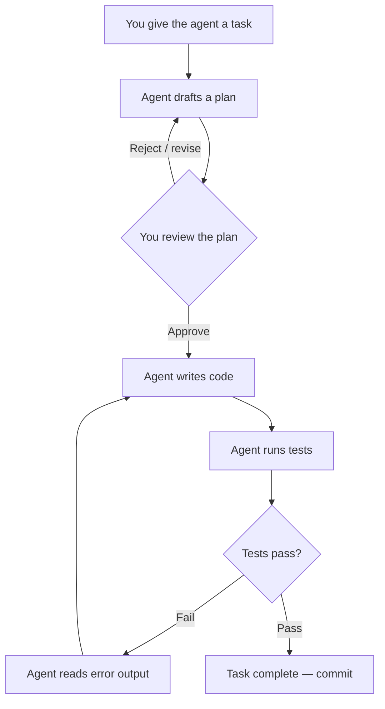
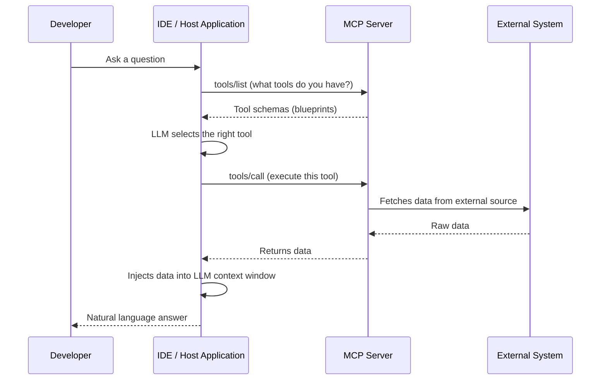

# Agentic Coding Guidelines

The era of writing every line of code manually is ending. Effective developers now operate as **orchestrators** — guiding autonomous AI agents to build, test, and debug software. This guide covers the workflows, configuration setups, and tool knowledge needed to integrate AI coding assistants into your daily development cycle without sacrificing code quality.

Treat your AI as an exceptionally fast, highly capable **junior engineer** who requires clear boundaries, strict instructions, and careful supervision — not as a senior mentor.

---

## 1. Manage Your Context

An AI's **context window** is its short-term memory. It holds your prompt, the files it has read, and the output it generates. It is finite.

| Context Type | Description | Risk |
|-------------|-------------|------|
| **Static Context** | Foundational project rules (e.g., CLAUDE.md). Cached — fast and cheap. | Low |
| **Dynamic Context** | Builds up as the agent reads files, runs commands, outputs logs. | High — can cause "context rot" |

**The Trap:** Tool outputs (massive error stack traces, full file dumps) are the biggest cause of context rot. If dynamic context gets too bloated, the AI forgets your original instructions and starts making mistakes.

**The Solution:** Use progressive disclosure. Give the agent lightweight file paths and let it load data only when needed. If the agent gets confused, start a fresh session to wipe the dynamic context.

---

## 2. Proven Workflows

### Workflow 1: Spec-Driven Development (SDD)

Before allowing the AI to generate a single line of code, write a `spec.md` document. This forces you to think through the architecture and gives the AI a definitive source of truth.

A good spec includes:

| Section | Content |
|---------|---------|
| **Objective** | What are we building? |
| **Tech Stack** | Languages, frameworks, and exact versions |
| **Commands** | How to build, test, and lint the project |
| **Boundaries** | Explicit rules — "Always run tests before commits", "Never commit secrets", "Ask before modifying database schemas" |

Notable SDD toolkits: OpenSpec, SpecKit.

### Workflow 2: The Plan-Act-Reflect Loop

Enforce a strict operational loop to prevent the agent from rushing into code with unchecked assumptions:

**The Planning Gate:** Always stop after drafting a plan and get your approval. Catching architectural mistakes at plan stage prevents thousands of lines of messy code.

**The Execution Sub-loop:** Once approved, the agent writes code, runs tests (defined in your spec), reads terminal output, and self-corrects without you needing to paste errors.

### Workflow 3: Agentic Debugging

Do not blindly paste an error stack trace into the AI and ask for a fix.

1. **Reason first, then act:** Force the AI to explain its understanding of the data flow and root cause *before* generating a code patch
2. **Add logging:** Ask the AI to inject debug statements first, run the app, and feed actual runtime logs back to the agent
3. **Keep state clean:** If the agent fails after a few tries, context is likely polluted — start a fresh session

### Workflow 4: Version Control and Code Review

> **Golden rule:** AI agents can propose code, but they never own it.

- **Draft PRs only:** Configure your agent to open only draft Pull Requests. Never allow an AI to push directly to main or production
- **Mandatory human review:** Treat the agent's PR exactly as you would a human's — review logic, check edge cases, verify security (input validation, auth logic)

---

## 3. Harness Engineering — CLAUDE.md / AGENTS.md

Create a `CLAUDE.md` or `AGENTS.md` file in the root of your repository. This acts as the agent's **permanent memory and system prompt** for the project.

**Rules for writing it:**

- Keep it under 200 lines — saves token costs and ensures the AI reads it carefully
- Make it **corrective, not just descriptive** — enforce rules based on past mistakes
  - Example: *"Always use forward slashes for file paths on Windows"*
  - Example: *"Never auto-commit code; ask for explicit permission first"*

---

## 4. MCPs — The Model Context Protocol

MCP acts as a universal adapter, giving your AI agent "hands" to interact with external systems — reading files, querying databases, searching the web, or managing your GitHub repository.

**How it works:**

**Essential MCP Servers:**

| MCP | Use |
|-----|-----|
| **GitHub MCP** | Read issues, review PRs, manage repository autonomously |
| **Playwright / Browserbase** | Control headless browser, run visual and E2E tests |
| **Context7** | Live developer documentation — prevents hallucinated outdated syntax |
| **Code-Review-Graph** | Parses codebase into AST via Tree-sitter, stored in SQLite. Agents query structure instead of grepping files — up to 120x token reduction on large tasks |
| **Graphify** | Similar to Code-Review-Graph — exposes codebase graph as LLM-callable tools for deep structural understanding |

---

## 5. AI Coding Tool Comparison

| Dimension | GitHub Copilot | Claude Code | Google Antigravity |
|-----------|---------------|------------|-------------------|
| **Interface** | Editor extension (VS Code, etc.) | CLI (terminal) | Standalone IDE |
| **Autonomy** | Medium — suggestions only, manual orchestration | High — autonomous terminal access, agentic loops | High — enforced Plan/Execute loops, built-in browser |
| **Best For** | Inline syntax help within familiar IDE | Deep reasoning for multi-step engineering backlogs | Architectural planning with persistent markdown artifacts |

*Open-source alternatives: **Aider** (terminal-first, git-native), **Pi** (minimalist), **Cline** (VS Code agentic assistant)*

---

## Conclusion

Agentic coding is not about letting an AI do your job. It is about elevating your role from **syntax-writer** to **system architect**. By mastering Spec-Driven Development, enforcing Plan-Act-Reflect loops, properly configuring CLAUDE.md, and leveraging MCP tools, developers can safely harness the productivity gains of modern AI assistants.
