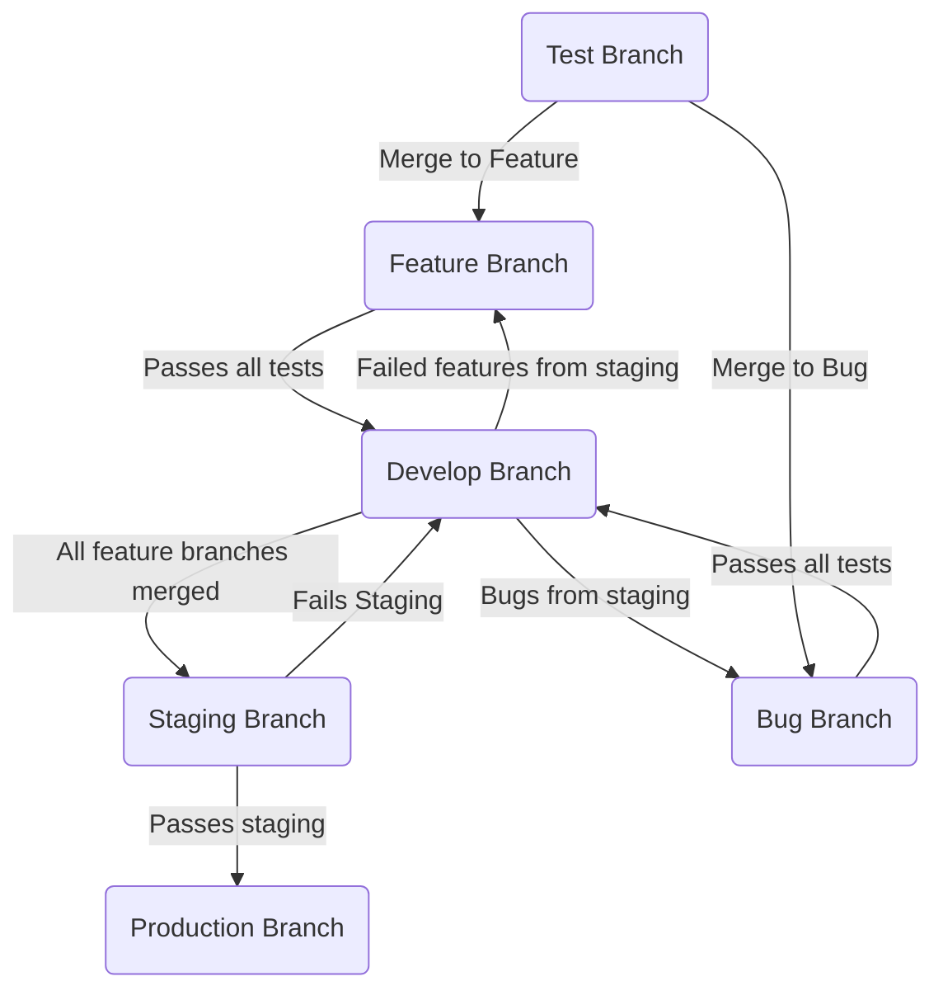

# Branching Strategy

## Branch Descriptions

| Branch | Role |
|--------|------|
| **Test** | Isolated testing before merging to feature or bug branches |
| **Feature** | Active feature development |
| **Develop** | Integration branch — all passing features merge here |
| **Staging** | Pre-production validation |
| **Production** | Live, user-facing code |
| **Bug** | Hotfixes — merges back to develop after passing tests |

## Key Rules

- Test branches merge into Feature or Bug branches (never directly to Develop)
- Feature branches require passing tests before merging to Develop
- Staging failures route back to Develop, not directly to Feature
- Production is only updated from Staging after it passes

---

*See also: [[Engineering/Git-Guidelines|Git Guidelines ←]]*
