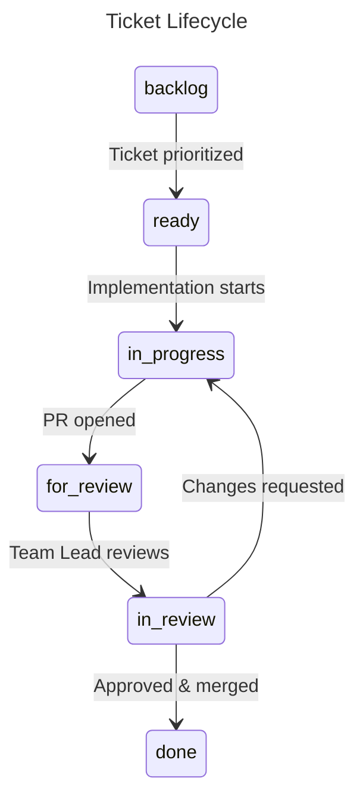

# Git Guidelines

## Branch Format

```
<branch-type>/<branch-name>-#<ticket-tag>
```

All characters lowercase. Use kebab-case for spaces.

**Example:** `feature/task-one-#F001`

## Branch Types

| Type | Purpose |
|------|---------|
| `feature` | Feature implementations |
| `bug` | Bug fixes |
| `refactor` | Re-implementing existing features |
| `doc` | Documentation |

## PR Guidelines

1. Create branch from the correct base branch
2. **Link the branch to the related GitHub issue**
3. Implement changes and push commits
4. Create PR targeting the **Develop branch**
5. **Link PR to issue**
6. **Move issue to "For Review"**
7. Address review feedback if needed
   - Maximum of **2 PR cycles** allowed
   - After the 2nd cycle, it merges into develop and the DATL aligns the feature to spec if needed
8. Merge upon approval and update issue status

## Ticket Lifecycle



---

*See also: [[Engineering/Branching-Strategy|Branching Strategy →]]*
