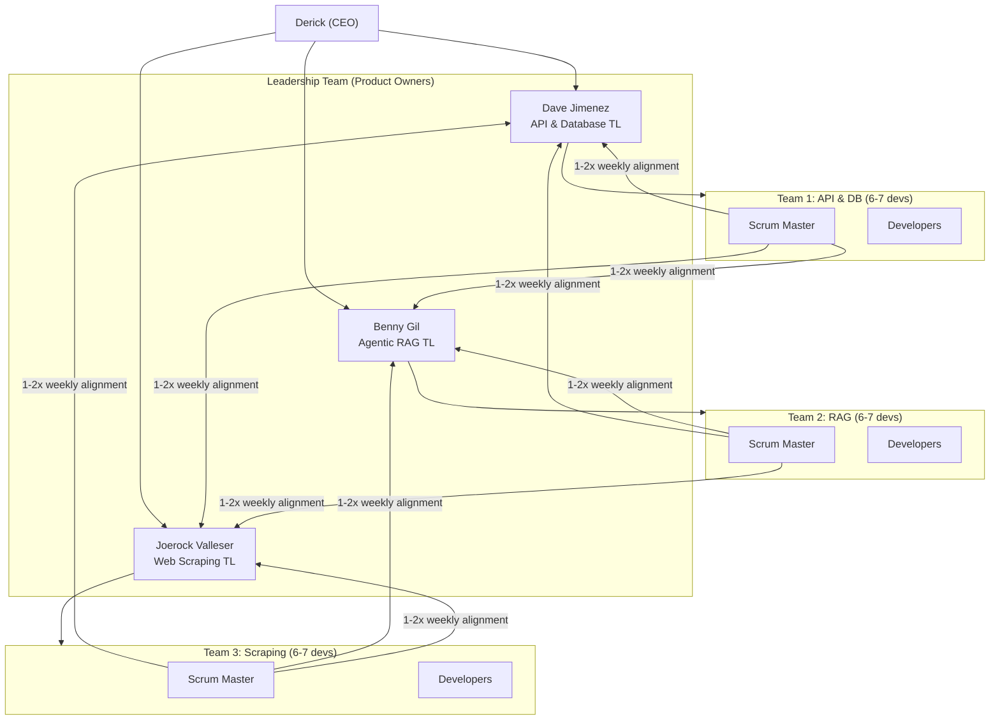
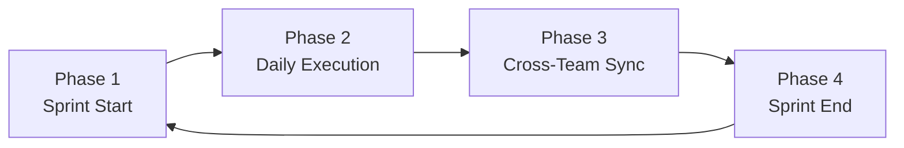

# Metawatt Scrum Handbook — Surplus Project

Effective project management is the key to maximizing productivity across 20+ developers on 3 distinct teams.

**Core Philosophy:** Every developer undergoes 3-day Scrum training. One developer per team assumes the Scrum Master role at the end of that period. **Any developer can (and should) act as Scrum Master if the designated person is absent.**

---

## 1. Scrum Terms

| Term | Definition |
|------|-----------|
| **Sprint** | Fixed time-boxed period (1–2 weeks) to produce a usable product increment |
| **Backlog** | Master list of all tasks, features, and requirements |
| **Sprint Backlog** | Subset of Backlog items selected for the current Sprint |
| **Scrum Master (SM)** | Servant-leader who facilitates Scrum events, removes blockers, ensures agile practices |
| **Blocker / Impediment** | Any issue (technical or organizational) preventing a developer from completing their task |
| **Ticket / Issue** | A single unit of work on the project board |
| **Kanban / Scrum Board** | Visual representation of work phases: To Do, In Progress, In Review, Done |
| **Increment** | Sum of all completed and merged work at Sprint end |
| **Velocity** | Measure of how much work a team completes per Sprint |
| **Scrum of Scrums** | Weekly sync where team Scrum Masters meet with Team Leads to coordinate cross-team dependencies |

---

## 2. Team Structure

### Roles

| Role | Responsibility |
|------|---------------|
| **Developers** | Self-managing. Estimate own work, pick up tickets, collaborate |
| **Scrum Master** | Tracks, facilitates, removes blockers. Any developer can step in if SM is absent |
| **Team Leads (Dave, Benny, Joerock)** | Product Owners. Prioritize backlog, accept completed work, define technical vision |

---

## 3. Sprint Lifecycle

### Phase 1: Sprint Start

1. **Prioritization:** Team Leads prioritize the Master Backlog
2. **Sprint Planning:** Team and Team Leads agree on the Sprint Goal. Developers pull tickets into the Sprint Backlog, estimate effort, and flag cross-team dependencies

### Phase 2: Daily Execution

1. **Daily Scrum (15 min max):** Each developer answers:
   - *What did I accomplish yesterday?*
   - *What will I work on today?*
   - *Are there any blockers in my way?*
   > Do not solve deep technical problems during standup. Take them to a separate discussion immediately after.

2. **Board Updates & Unblocking:** Scrum Master updates the board and acts immediately on any raised blockers

### Phase 3: Cross-Team Sync

1. **Leadership Alignment Meeting (1–2x weekly):** Scrum Masters meet with Dave, Benny, and Joerock to report velocity, highlight cross-team dependencies, and align for upcoming sprints

### Phase 4: Sprint End

1. **Sprint Review:** Team demos working software / completed tickets to Team Leads
2. **Sprint Retrospective:** Internal meeting — what went well, what went wrong, process improvements for the next Sprint

---

## 4. Board Management

Rules apply regardless of whether the team uses GitHub Projects, ClickUp, or any other PM tool.

### Ticket States

| State | Meaning |
|-------|---------|
| **To Do** | Planned for the sprint but not started |
| **In Progress** | Currently being worked on *(limit WIP to avoid context switching)* |
| **In Review** | Code complete, awaiting PR review or QA *(max 2 PR cycles before merge to develop)* |
| **Done** | Merged, tested, and accepted |

### Ticket Hygiene

A ticket is not valid unless it has:
- Clear title and description
- An assignee (who is doing the work)
- Acceptance criteria (how do we know it is "Done"?)
- Direct link to associated GitHub branch and Pull Request

### Flagging Blockers

Blocked tickets must be visibly flagged (label, tag, or "Blocked" column) so the Scrum Master can spot and act on them immediately.

---

## 5. Scrum Master Checklists

### Daily Checklist

- [ ] **Review the Board** — Before Daily Scrum, check for tickets in "In Progress" too long or missing assignees
- [ ] **Facilitate Daily Scrum** — Start on time, stay under 15 minutes, prevent deep technical debates
- [ ] **Unblock the Team** — Identify blockers from standup and coordinate with other teams or Team Leads to resolve
- [ ] **Stakeholder Transparency** — Ensure board state accurately reflects reality for async viewing by Dave, Benny, Joerock

### Weekly / Sprint Checklist

- [ ] **Prep the Backlog** — Ensure backlog is prioritized and tickets are well-defined before Sprint Planning
- [ ] **Facilitate the Retrospective** — Create a safe space for developers to voice frustrations and celebrate wins
- [ ] **Attend Leadership Alignment** — Bring data: team velocity, biggest risks, cross-team support needed

---

*See also: [[Essentials/Personnel|Personnel — team contacts →]]  
[[Operations/Daily-Schedule|Daily Schedule →]]*
