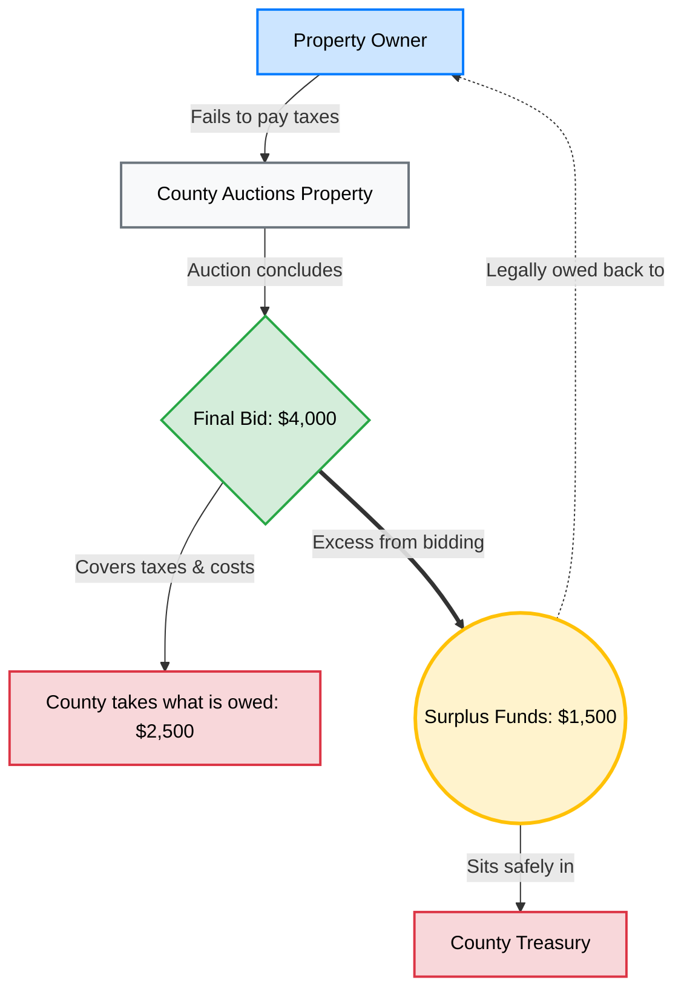
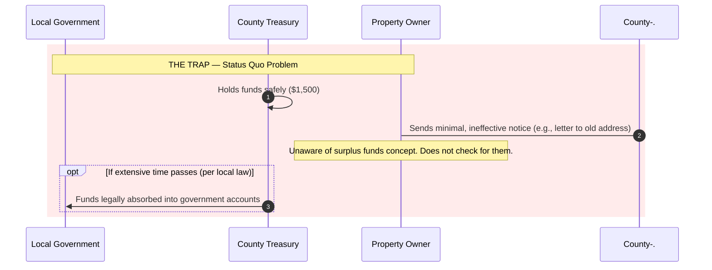

# Surplus Funds

Surplus Funds is a Metawatt project developed to help individuals in the US recover surplus funds from counties.

## What Are Surplus Funds?

When individuals fail to pay their taxes, their property gets auctioned off by their county to cover the cost. The final bid may exceed the property's actual value. The county only takes what is owed — the remaining excess sits in the county treasury. That excess is **surplus funds**, and it is legally owed back to the original property owner.

**Example:** Property valued at $2,500 sells at auction for $4,000. The county takes $2,500. The remaining $1,500 is surplus funds owed to the former owner.

## The Problem

Counties keep surplus funds safely but make minimal effort to notify property owners. Some send a letter to the property address, but most individuals are unaware that surplus funds even exist. Compounding this: local laws in many counties allow surplus funds to be absorbed into government accounts after a set period of inactivity.

Retrieving surplus funds is not as simple as walking into a county office. It requires going through a legal process with an attorney — paperwork and many months of processing before funds are released.

---

*Next: [[Surplus-Funds/SFA-Process|How Surplus Funds Acquisition works →]]*  
*See also: [[Systems/Overview|The technical system that automates this process →]]*
