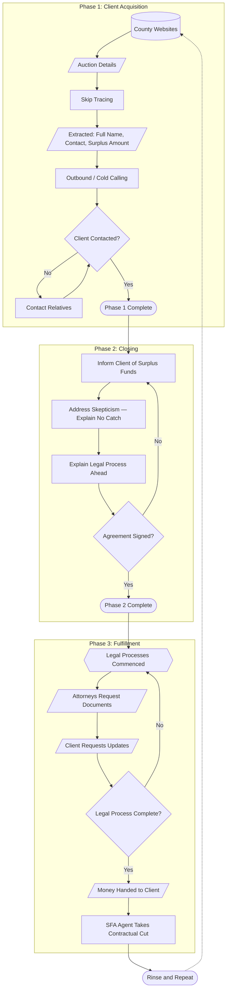
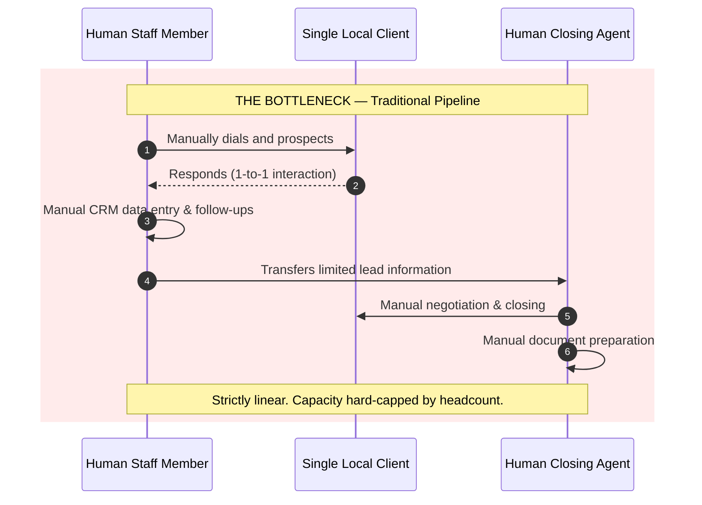
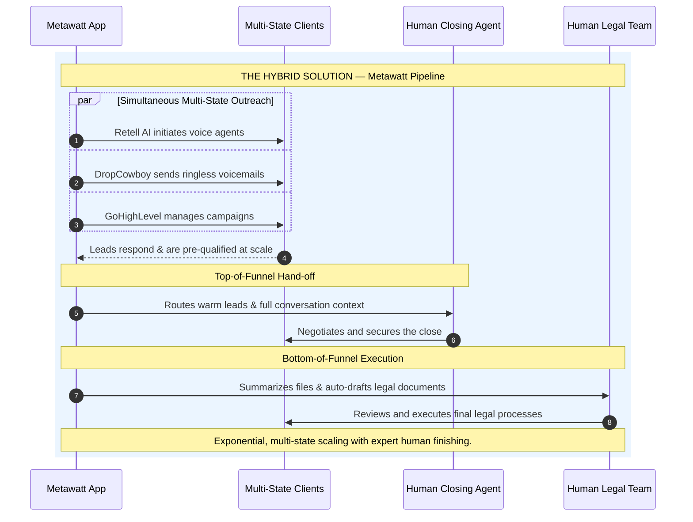

# Surplus Funds Acquisition Process

Surplus Funds Acquisition (SFA) is performed by agents who locate property owners with unclaimed surplus funds, inform them, and handle retrieval for a commission. There are 3 phases: **Client Acquisition**, **Closing**, and **Fulfillment**.

## Phase 1: Client Acquisition

Most auction data is publicly available on county websites. Skip tracing extracts the property owner's full name, contact details, surplus amount, and other information. The SFA agent then reaches out via all possible channels. If direct contact fails, they attempt to reach the owner through relatives.

## Phase 2: Closing

The agent informs the client of their owed funds and aims to get them to sign a retrieval agreement. The key challenge is trust — from the client's perspective, "free money" sounds suspicious. There is no catch: the legal complexity is real, and the agent handles it for a commission (typically 30%).

**Example payout:** $1,500 surplus × 30% commission = $450 to agent, $1,050 to client.

## Phase 3: Fulfillment

Attorneys handle the formal legal process: document requests, county submissions, and months of processing time. Once approved, funds are released and split per the signed agreement.

---

## Traditional vs. Metawatt Pipeline

**The bottleneck:** Traditional SFA is strictly manual and 1-to-1. Every interaction requires a human staff member. Capacity is hard-capped by headcount.

**The Metawatt solution:** AI tools handle top-of-funnel outreach at scale across multiple states simultaneously. Warm leads are handed off to human closers with full context. Legal teams handle fulfillment assisted by AI-drafted documents.

---

*See also: [[Systems/Overview|The technical system that powers this →]]*
