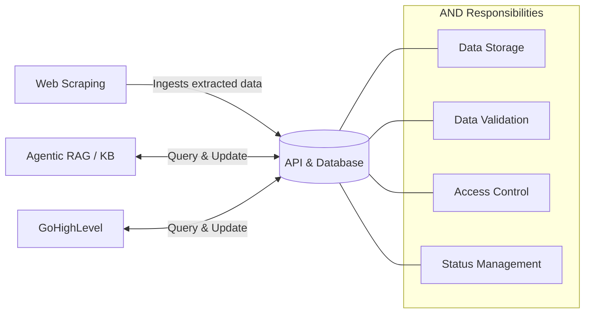

# API & Database Integration

AND connects to every other component in the Surplus system. It is the glue that holds the application together.

## Full Integration Map

## Integration by Component

### Web Scraping → AND
- **Direction:** One-way write (WS writes, AND stores)
- **Payload:** Lead records extracted from county portals
- **Concern:** Deduplication — same auction may be scraped multiple times

### AND ↔ GoHighLevel
- **Direction:** Bidirectional
- **AND → GHL:** Provides qualified leads for campaign execution
- **GHL → AND:** Writes back interaction logs, status updates, and outcome data
- **Rule:** GHL must not be used as the authoritative record. All status changes must sync back to AND.

### AND ↔ Agentic RAG / KB
- **Direction:** Bidirectional
- **AND → RAG/KB:** Provides lead context for AI decision-making
- **RAG/KB → AND:** May write enriched data or AI-generated summaries back

## Why AND Complexity Is Highest

- Every component integrates through AND
- Schema changes break all consumers simultaneously
- Status management must handle concurrent reads and writes from GHL and RAG/KB
- Proper indexing is critical for query performance at scale

---

*See also: [[Systems/API-Database/Overview|API & Database Overview ←]]  
[[Systems/GoHighLevel/Integration|GoHighLevel Integration →]]  
[[Systems/Web-Scraping/Integration|Web Scraping Integration ←]]*
