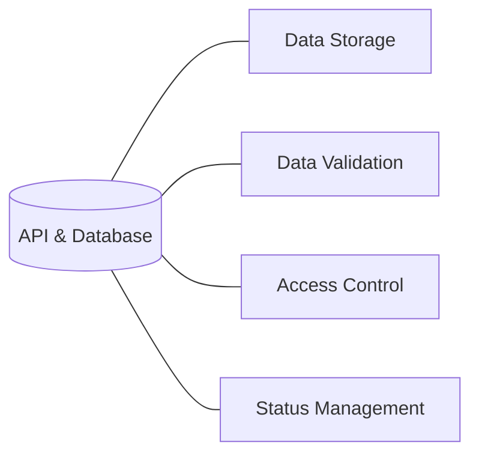

# API & Database Component

The API & Database (AND) component is the central data layer of the Surplus application. Every other component connects through it, making AND the most complex integration point in the system.

## Role

AND manages all lead and client information. This includes:

- Raw data ingested from [[Systems/Web-Scraping/Overview|Web Scraping]]
- Supporting information added during the pipeline
- Lead/client status throughout the acquisition lifecycle
- Interaction logs from [[Systems/GoHighLevel/Overview|GoHighLevel]]

**AND is the single source of truth.** Other components (GHL, RAG/KB) may hold local copies of data, but AND's records are authoritative.

## Responsibilities

| Responsibility | Description |
|----------------|-------------|
| **Data Storage** | Persist all lead/client records, supporting documents, and logs |
| **Data Validation** | Ensure incoming data meets schema requirements before storage |
| **Access Control** | Regulate which components can read or write which records |
| **Status Management** | Track each lead's position in the acquisition lifecycle |

## Design Priority

The primary concern is ensuring data is **easily sent, retrieved, updated, and tracked**. Proper SQL table design is critical. Schema changes have downstream impact on every connected component.

---

*See also: [[Systems/API-Database/Integration|Integration details →]]  
[[Systems/Overview|Back to Systems Overview →]]*
