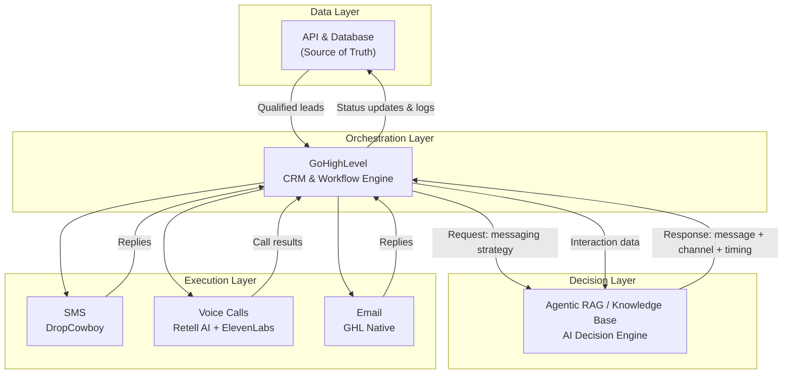

# GoHighLevel Integration

GHL is the most connected operational component in the Surplus system. It coordinates between the data layer, the AI decision engine, and the outreach execution tools.

## Full Data Flow

## Integration Details

### AND → GHL
- AND pushes qualified leads to GHL to begin campaign execution
- Lead records include all skip-traced data plus any enrichment added since ingestion

### GHL → RAG/KB (Request)
- Before each outreach action, GHL queries RAG/KB for the optimal message, channel, and timing
- RAG/KB uses lead context + business knowledge to formulate a strategy

### RAG/KB → GHL (Response)
- RAG/KB returns a structured response: which channel to use, what message to send, when to send it
- GHL executes that strategy via the appropriate channel tool

### Execution Layer → GHL (Inbound)
- SMS replies, call outcomes, and email responses all flow back into GHL
- GHL processes these to determine next actions (follow-up, escalate to human closer, close)

### GHL → RAG/KB (Feedback)
- Interaction data is fed back to RAG/KB to update its context on the lead
- Enables the AI to adjust strategy based on how the lead has responded

### GHL → AND (Write-back)
- All status changes and interaction logs are written back to AND
- This is mandatory — AND must stay authoritative

---

*See also: [[Systems/GoHighLevel/Overview|GoHighLevel Overview ←]]  
[[Systems/Agentic-RAG/Overview|Agentic RAG / KB →]]  
[[Systems/API-Database/Integration|API & Database Integration ←]]*
