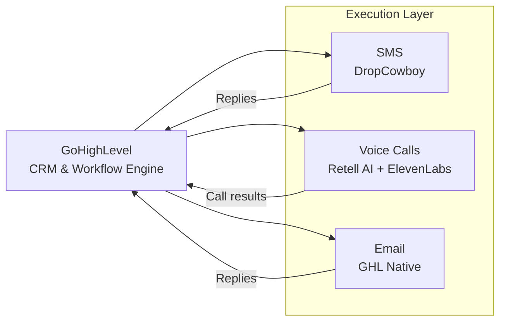

# GoHighLevel Component

GoHighLevel (GHL) is the **CRM and workflow engine** of the Surplus application. It orchestrates the execution layer — managing outreach campaigns, handling lead interactions, and routing data between the AI decision layer and human staff.

## Role in the Pipeline

GHL sits between the data layer ([[Systems/API-Database/Overview|AND]]) and the execution tools. It:

1. Receives qualified leads from AND
2. Requests messaging strategy from [[Systems/Agentic-RAG/Overview|Agentic RAG / KB]]
3. Executes outreach via SMS, voice calls, and email
4. Processes responses and routes warm leads to human closers
5. Writes interaction data and status updates back to AND

## Execution Channels

| Channel | Tool |
|---------|------|
| SMS | DropCowboy |
| Voice Calls | Retell AI + ElevenLabs |
| Email | GHL Native |

## Website Builder

GHL also provides built-in website creation tools. This is used to build a client-facing site that informs leads and clients about the Surplus Funds Acquisition process, establishing credibility before and during the closing phase.

## Data Ownership Rule

GHL stores data locally for operational efficiency, but **AND is the source of truth**. Every status change, interaction log, and outcome recorded in GHL must be written back to AND to keep the system in sync.

---

*See also: [[Systems/GoHighLevel/Integration|Full data flow diagram →]]  
[[Systems/Overview|Back to Systems Overview →]]*
