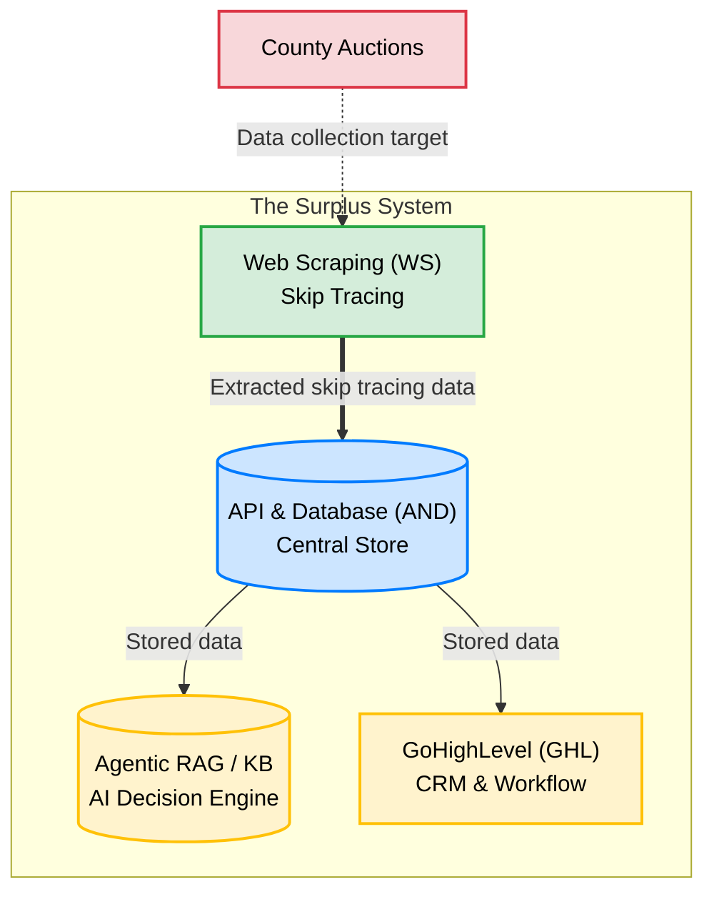

# Systems Overview

The Surplus application consists of 4 components. Each plays a critical role in the business pipeline.

| Component | Abbreviation | Role |
|-----------|-------------|------|
| Web Scraping | WS | Skip tracing — collects client data from county auction portals |
| API & Database | AND | Central data store — receives, stores, and serves data to all other components |
| GoHighLevel | GHL | CRM & workflow engine — executes outreach and manages lead lifecycle |
| Agentic RAG / Knowledge Base | RAG/KB | AI decision engine — provides context-aware responses and strategy |

## Data Flow Summary

1. **WS** scrapes county auction portals and extracts lead data
2. **AND** receives that data, stores it, and serves it to downstream components
3. **GHL** pulls qualified leads from AND, runs outreach campaigns, and writes status updates back to AND
4. **RAG/KB** receives queries from GHL and returns context-aware messaging strategy

AND is the source of truth for all lead/client data. GHL and RAG/KB may cache data locally, but AND is authoritative.

## Component Notes

- [[Systems/Web-Scraping/Overview|Web Scraping — Overview]]
- [[Systems/Web-Scraping/Integration|Web Scraping — Integration]]
- [[Systems/API-Database/Overview|API & Database — Overview]]
- [[Systems/API-Database/Integration|API & Database — Integration]]
- [[Systems/GoHighLevel/Overview|GoHighLevel — Overview]]
- [[Systems/GoHighLevel/Integration|GoHighLevel — Integration]]
- [[Systems/Agentic-RAG/Overview|Agentic RAG — Overview]]
