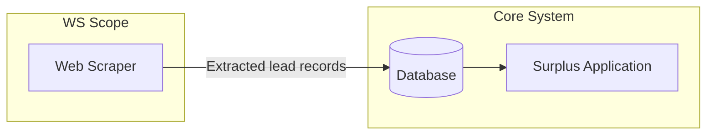

# Web Scraping Integration

The WS component has the simplest integration boundary in the Surplus system. Its only outbound concern is writing extracted data to the [[Systems/API-Database/Overview|API & Database component]].

## Data Flow

## What WS Sends to AND

Each scraped record includes:

| Field | Description |
|-------|-------------|
| Full name | Property owner's name |
| Contact details | Phone, address, email (if available) |
| Surplus amount | Dollar value of unclaimed funds |
| County | Source county |
| Auction date | When the auction occurred |
| Property details | Address, parcel ID |

## Integration Rules

- WS only **writes** to AND — it never reads from it
- WS does not communicate with GHL or RAG/KB directly
- Each scraper run should be idempotent: re-scraping the same auction should not create duplicate records (AND is responsible for deduplication or the scraper should check before insert)

---

*See also: [[Systems/Web-Scraping/Overview|Web Scraping Overview ←]]  
[[Systems/API-Database/Overview|API & Database receives this data →]]*
