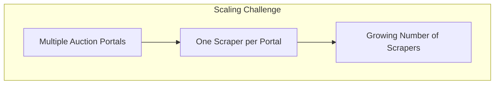
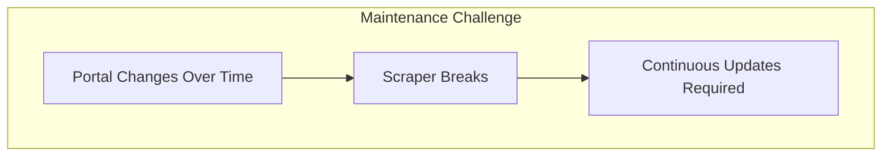

# Web Scraping Component

The Web Scraping (WS) component is where the Surplus pipeline starts. It performs **skip tracing** — automatically extracting client data from county auction portals rather than manually noting it by hand.

## What It Does

Most auction data is publicly available on county websites and auction portals. These contain:

- Property owner's full name
- Contact details
- Surplus funds amount
- Property details and auction outcomes

The WS component scrapes these portals and delivers extracted records to the [[Systems/API-Database/Overview|API & Database component]].

## Integration Scope

The WS component has a narrow integration surface: it only needs to upload data into the database. This allows the team to focus entirely on scraping quality without managing complex downstream concerns.

See [[Systems/Web-Scraping/Integration|Web Scraping Integration]] for the data handoff details.

## Challenges

### Horizontal Scaling

It is not possible to build a single general-purpose scraper that works on every auction portal. Each portal has its own structure, pagination, and data format. A dedicated scraper must be developed per portal.

### Maintenance

Auction portals change their layouts and data structures over time. When a portal changes, its scraper breaks. Every scraper must be actively monitored and updated.

These two challenges compound: as the number of scrapers grows (scaling), so does the maintenance burden.

---

*See also: [[Systems/Web-Scraping/Integration|Integration details →]]  
[[Systems/Overview|Back to Systems Overview →]]*
