# Vault Organization Implementation Plan

> **For agentic workers:** REQUIRED SUB-SKILL: Use superpowers:subagent-driven-development (recommended) or superpowers:executing-plans to implement this plan task-by-task. Steps use checkbox (`- [ ]`) syntax for tracking.

**Goal:** Decompose `MetaWatt Internship Guidebook.md` into 20 organized notes across logical folders, with proper Mermaid diagrams and WikiLinks, deployable as a Quartz v4 site.

**Architecture:** Topic-based folder hierarchy with Systems/ getting deep treatment (component + integration notes). All diagrams rewritten as native Mermaid code blocks. WikiLinks connect related notes. Original monolithic file deleted at the end.

**Tech Stack:** Markdown, Mermaid, Obsidian WikiLinks, Quartz v4 frontmatter (YAML)

---

## File Map

| File | Status | Responsibility |
|------|--------|----------------|
| `content/index.md` | Create | Home page, links all sections |
| `content/Introduction.md` | Create | Metawatt overview, vision, mission |
| `content/Essentials/Personnel.md` | Create | Team table, contacts, roles |
| `content/Essentials/Communications.md` | Create | ClickUp, GitHub Projects |
| `content/Surplus-Funds/Overview.md` | Create | What surplus funds are, the problem |
| `content/Surplus-Funds/SFA-Process.md` | Create | 3-phase acquisition, traditional vs Metawatt pipeline |
| `content/Systems/Overview.md` | Create | 4-component architecture hub |
| `content/Systems/Web-Scraping/Overview.md` | Create | WS role, scaling & maintenance challenges |
| `content/Systems/Web-Scraping/Integration.md` | Create | WS → AND data handoff |
| `content/Systems/API-Database/Overview.md` | Create | AND responsibilities |
| `content/Systems/API-Database/Integration.md` | Create | AND as central glue |
| `content/Systems/GoHighLevel/Overview.md` | Create | CRM role, execution layer, website builder |
| `content/Systems/GoHighLevel/Integration.md` | Create | Full GHL ↔ AND ↔ RAG/KB data flow |
| `content/Systems/Agentic-RAG/Overview.md` | Create | KB role, context prep |
| `content/Engineering/Git-Guidelines.md` | Create | Branch format, PR process, ticket lifecycle |
| `content/Engineering/Branching-Strategy.md` | Create | Branch flow diagram |
| `content/Engineering/Agentic-Coding.md` | Create | 4 workflows, harness, MCPs, tool comparison |
| `content/Operations/Scrum-Handbook.md` | Create | Full scrum guide |
| `content/Operations/Daily-Schedule.md` | Create | 5:00–12:50 daily timeline |
| `content/Operations/Calendar.md` | Create | May–July 2026 milestones |
| `content/MetaWatt Internship Guidebook.md` | Delete | Replaced by above |

---

## Task 1: Create Folder Structure

**Files:**
- Create directories: `Systems/Web-Scraping/`, `Systems/API-Database/`, `Systems/GoHighLevel/`, `Systems/Agentic-RAG/`, `Essentials/`, `Surplus-Funds/`, `Engineering/`, `Operations/`

- [ ] **Step 1: Create all folders**

```bash
cd /home/torrap/WebDev/metawatt/SURPL-GRP.github.io/content
mkdir -p Systems/Web-Scraping Systems/API-Database Systems/GoHighLevel Systems/Agentic-RAG
mkdir -p Essentials Surplus-Funds Engineering Operations
```

- [ ] **Step 2: Verify structure**

```bash
find . -type d | sort
```

Expected output includes all 8 folders listed above.

- [ ] **Step 3: Commit**

```bash
cd /home/torrap/WebDev/metawatt/SURPL-GRP.github.io
git add content/
git commit -m "chore: scaffold vault folder structure"
```

---

## Task 2: index.md

**Files:**
- Create: `content/index.md`

- [ ] **Step 1: Create the file**

```markdown
---
title: MetaWatt Surplus Project
tags: [index]
---

# MetaWatt Surplus Project

Welcome to the MetaWatt Surplus Project knowledge base. Use the links below to navigate.

## Sections

- [[Introduction]] — What Metawatt is, vision & mission
- [[Essentials/Personnel|Personnel]] — Team members, roles, contacts
- [[Essentials/Communications|Communications]] — Platforms and tools
- [[Surplus-Funds/Overview|Surplus Funds]] — Business domain overview
- [[Surplus-Funds/SFA-Process|SFA Process]] — 3-phase acquisition workflow
- [[Systems/Overview|Systems Overview]] — Architecture of the Surplus application
- [[Engineering/Git-Guidelines|Git Guidelines]] — Branching, PRs, ticket lifecycle
- [[Engineering/Branching-Strategy|Branching Strategy]] — Branch flow diagram
- [[Engineering/Agentic-Coding|Agentic Coding Guidelines]] — AI-assisted development workflows
- [[Operations/Scrum-Handbook|Scrum Handbook]] — Sprint lifecycle, roles, checklists
- [[Operations/Daily-Schedule|Daily Schedule]] — Daily internship timeline
- [[Operations/Calendar|Calendar]] — May–July 2026 milestones
```

- [ ] **Step 2: Verify**

```bash
cat content/index.md
```

Expected: file exists with frontmatter and all 12 links.

- [ ] **Step 3: Commit**

```bash
git add content/index.md
git commit -m "docs: add vault index page"
```

---

## Task 3: Introduction.md

**Files:**
- Create: `content/Introduction.md`

- [ ] **Step 1: Create the file**

```markdown
---
title: Introduction to Metawatt
tags: [essentials]
---

# Introduction to Metawatt

## What Metawatt Is

Metawatt is an AI-focused platform that provides hands-on learning experiences through real-world projects and practical training. It bridges the gap between academic knowledge and industry application by giving learners access to tools, mentorship, and project-based work in artificial intelligence and related fields.

Rather than focusing solely on theory, Metawatt emphasizes experiential learning — interns actively build, test, and deploy solutions in realistic scenarios.

## What We Do at Metawatt

At Metawatt, we design and develop AI-driven solutions while training individuals to become industry-ready professionals. Our work involves applying artificial intelligence, data analysis, and automation to solve real-world problems.

As an intern, you can expect to:

- Work on real or simulated industry projects
- Collaborate with mentors and fellow interns
- Gain exposure to modern AI tools and workflows
- Develop both technical and professional skills

## Vision

To cultivate a generation of innovators equipped with the skills and mindset to shape the future through artificial intelligence.

## Mission

- Provide accessible, hands-on learning in AI and emerging technologies
- Bridge the gap between education and industry through real-world experience
- Empower individuals with practical, job-ready skills
- Foster a collaborative environment that encourages innovation and growth

---

*Next: [[Essentials/Personnel|Meet the team →]]*
```

- [ ] **Step 2: Verify**

```bash
cat content/Introduction.md
```

Expected: file exists with frontmatter, 3 sections, mission bullets, nav link.

- [ ] **Step 3: Commit**

```bash
git add content/Introduction.md
git commit -m "docs: add Introduction note"
```

---

## Task 4: Essentials

**Files:**
- Create: `content/Essentials/Personnel.md`
- Create: `content/Essentials/Communications.md`

- [ ] **Step 1: Create Personnel.md**

```markdown
---
title: Personnel
tags: [essentials]
---

# Personnel

These are Metawatt's personnel who manage the Surplus Project. Interns can reach them via the communication platforms or their contacts below.

| Name | Role | Contacts |
|------|------|----------|
| **Derick** | CEO | — |
| **Dave Angelo D. Jimenez** | Junior Developer · API & Database TL · Roll Call Master | 09987755681 · ddjimenez555@gmail.com |
| **Benny Gil Lactaotao** | Junior Developer · Agentic RAG TL · Former Web Scraping TL | benny.gil999@gmail.com |
| **Kevin Cruz** | Senior Developer · Consultant · Former Agentic RAG TL | — |
| **Joerock Valleser** | Junior Developer · Web Scraping TL | joevalleser@gmail.com |
| **Asif Saeed** | GoHighLevel TL | asifsaeed8122@gmail.com |

---

*See also: [[Operations/Scrum-Handbook|Scrum Handbook]] — team structure and roles*
```

- [ ] **Step 2: Create Communications.md**

```markdown
---
title: Communications & Management
tags: [essentials]
---

# Communications & Management

| Platform | Purpose |
|----------|---------|
| **ClickUp** | Work Proper · Primary Communication Platform · Project Management |
| **Github Projects** | GitHub Project Management |
```

- [ ] **Step 3: Verify both files**

```bash
cat content/Essentials/Personnel.md && echo "---" && cat content/Essentials/Communications.md
```

- [ ] **Step 4: Commit**

```bash
git add content/Essentials/
git commit -m "docs: add Essentials notes (Personnel, Communications)"
```

---

## Task 5: Surplus-Funds/Overview.md

**Files:**
- Create: `content/Surplus-Funds/Overview.md`

- [ ] **Step 1: Create the file**

````markdown
---
title: Surplus Funds Overview
tags: [surplus-funds]
---

# Surplus Funds

Surplus Funds is a Metawatt project developed to help individuals in the US recover surplus funds from counties.

## What Are Surplus Funds?

When individuals fail to pay their taxes, their property gets auctioned off by their county to cover the cost. The final bid may exceed the property's actual value. The county only takes what is owed — the remaining excess sits in the county treasury. That excess is **surplus funds**, and it is legally owed back to the original property owner.

**Example:** Property valued at $2,500 sells at auction for $4,000. The county takes $2,500. The remaining $1,500 is surplus funds owed to the former owner.

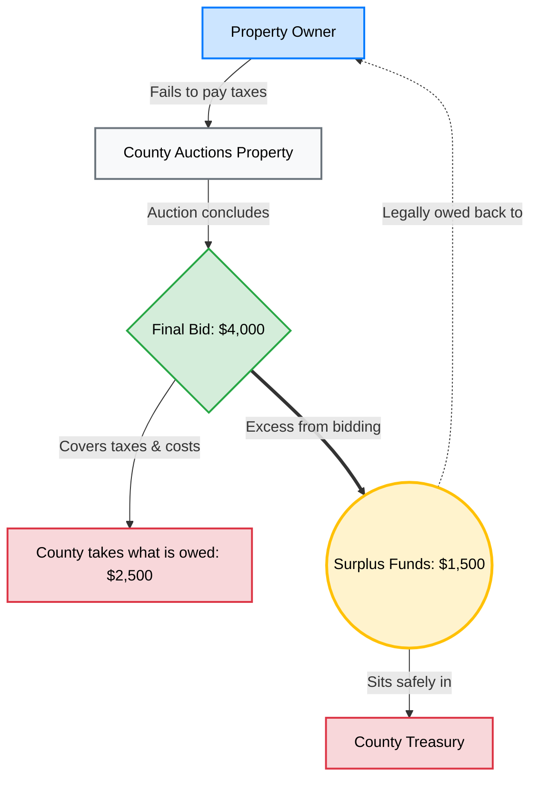

## The Problem

Counties keep surplus funds safely but make minimal effort to notify property owners. Some send a letter to the property address, but most individuals are unaware that surplus funds even exist. Compounding this: local laws in many counties allow surplus funds to be absorbed into government accounts after a set period of inactivity.

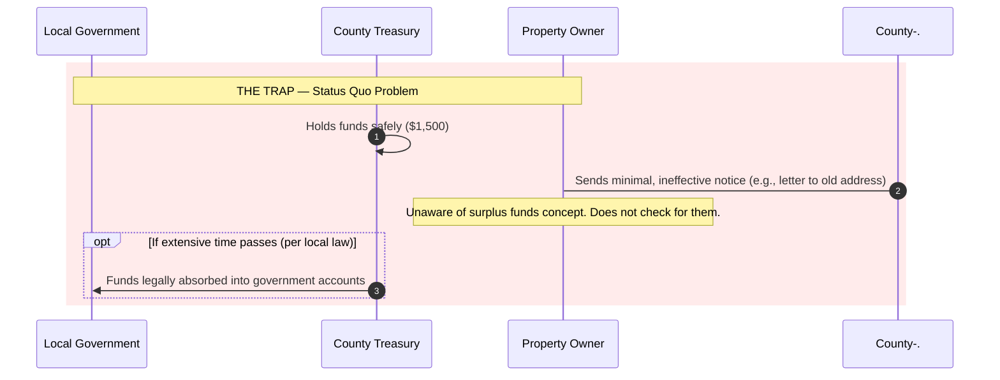

Retrieving surplus funds is not as simple as walking into a county office. It requires going through a legal process with an attorney — paperwork and many months of processing before funds are released.

---

*Next: [[Surplus-Funds/SFA-Process|How Surplus Funds Acquisition works →]]*  
*See also: [[Systems/Overview|The technical system that automates this process →]]*
````

- [ ] **Step 2: Verify**

```bash
grep -c '```mermaid' content/Surplus-Funds/Overview.md
```

Expected: `2` (two Mermaid blocks)

- [ ] **Step 3: Commit**

```bash
git add content/Surplus-Funds/Overview.md
git commit -m "docs: add Surplus Funds Overview note with diagrams"
```

---

## Task 6: Surplus-Funds/SFA-Process.md

**Files:**
- Create: `content/Surplus-Funds/SFA-Process.md`

- [ ] **Step 1: Create the file**

````markdown
---
title: Surplus Funds Acquisition Process
tags: [surplus-funds]
---

# Surplus Funds Acquisition Process

Surplus Funds Acquisition (SFA) is performed by agents who locate property owners with unclaimed surplus funds, inform them, and handle retrieval for a commission. There are 3 phases: **Client Acquisition**, **Closing**, and **Fulfillment**.

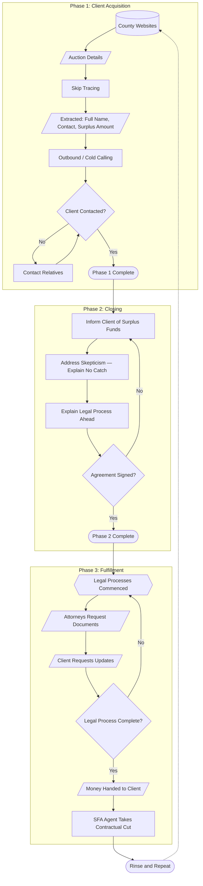

## Phase 1: Client Acquisition

Most auction data is publicly available on county websites. Skip tracing extracts the property owner's full name, contact details, surplus amount, and other information. The SFA agent then reaches out via all possible channels. If direct contact fails, they attempt to reach the owner through relatives.

## Phase 2: Closing

The agent informs the client of their owed funds and aims to get them to sign a retrieval agreement. The key challenge is trust — from the client's perspective, "free money" sounds suspicious. There is no catch: the legal complexity is real, and the agent handles it for a commission (typically 30%).

**Example payout:** $1,500 surplus × 30% commission = $450 to agent, $1,050 to client.

## Phase 3: Fulfillment

Attorneys handle the formal legal process: document requests, county submissions, and months of processing time. Once approved, funds are released and split per the signed agreement.

---

## Traditional vs. Metawatt Pipeline

**The bottleneck:** Traditional SFA is strictly manual and 1-to-1. Every interaction requires a human staff member. Capacity is hard-capped by headcount.

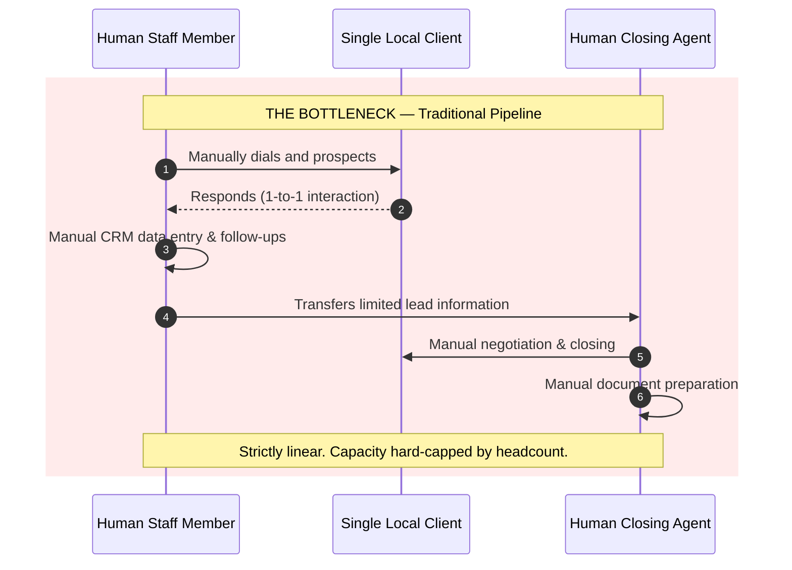

**The Metawatt solution:** AI tools handle top-of-funnel outreach at scale across multiple states simultaneously. Warm leads are handed off to human closers with full context. Legal teams handle fulfillment assisted by AI-drafted documents.

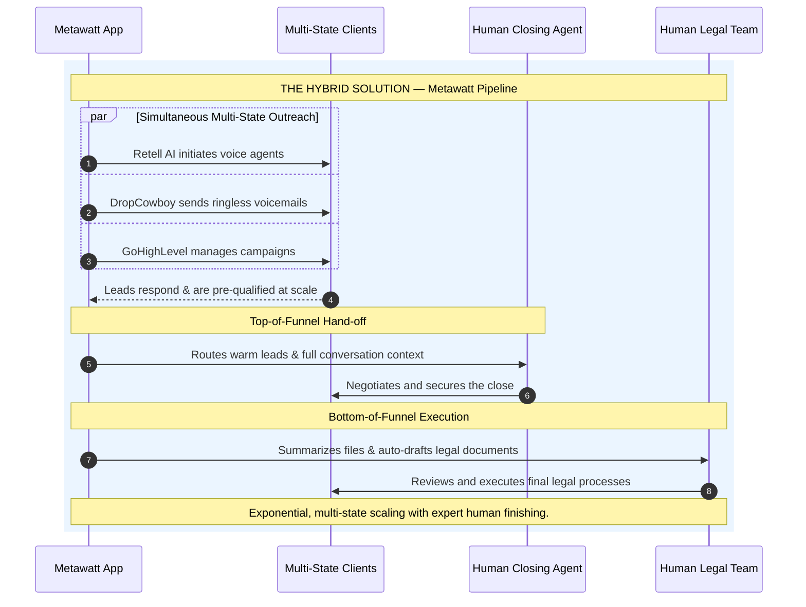

---

*See also: [[Systems/Overview|The technical system that powers this →]]*
````

- [ ] **Step 2: Verify**

```bash
grep -c '```mermaid' content/Surplus-Funds/SFA-Process.md
```

Expected: `3`

- [ ] **Step 3: Commit**

```bash
git add content/Surplus-Funds/SFA-Process.md
git commit -m "docs: add SFA Process note with 3 Mermaid diagrams"
```

---

## Task 7: Systems/Overview.md

**Files:**
- Create: `content/Systems/Overview.md`

- [ ] **Step 1: Create the file**

````markdown
---
title: Systems Overview
tags: [systems]
---

# Systems Overview

The Surplus application consists of 4 components. Each plays a critical role in the business pipeline.

| Component | Abbreviation | Role |
|-----------|-------------|------|
| Web Scraping | WS | Skip tracing — collects client data from county auction portals |
| API & Database | AND | Central data store — receives, stores, and serves data to all other components |
| GoHighLevel | GHL | CRM & workflow engine — executes outreach and manages lead lifecycle |
| Agentic RAG / Knowledge Base | RAG/KB | AI decision engine — provides context-aware responses and strategy |

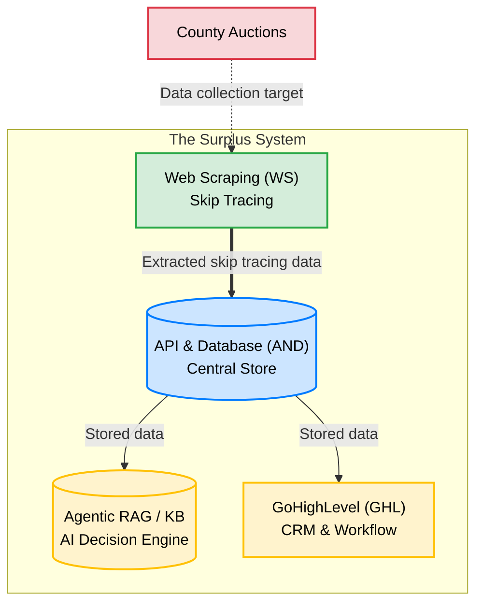

## Data Flow Summary

1. **WS** scrapes county auction portals and extracts lead data
2. **AND** receives that data, stores it, and serves it to downstream components
3. **GHL** pulls qualified leads from AND, runs outreach campaigns, and writes status updates back to AND
4. **RAG/KB** receives queries from GHL and returns context-aware messaging strategy

AND is the source of truth for all lead/client data. GHL and RAG/KB may cache data locally, but AND is authoritative.

## Component Notes

- [[Systems/Web-Scraping/Overview|Web Scraping — Overview]]
- [[Systems/Web-Scraping/Integration|Web Scraping — Integration]]
- [[Systems/API-Database/Overview|API & Database — Overview]]
- [[Systems/API-Database/Integration|API & Database — Integration]]
- [[Systems/GoHighLevel/Overview|GoHighLevel — Overview]]
- [[Systems/GoHighLevel/Integration|GoHighLevel — Integration]]
- [[Systems/Agentic-RAG/Overview|Agentic RAG — Overview]]
````

- [ ] **Step 2: Verify**

```bash
grep -c '```mermaid' content/Systems/Overview.md
```

Expected: `1`

- [ ] **Step 3: Commit**

```bash
git add content/Systems/Overview.md
git commit -m "docs: add Systems Overview note"
```

---

## Task 8: Systems/Web-Scraping/Overview.md

**Files:**
- Create: `content/Systems/Web-Scraping/Overview.md`

- [ ] **Step 1: Create the file**

````markdown
---
title: Web Scraping — Overview
tags: [systems, web-scraping]
---

# Web Scraping Component

The Web Scraping (WS) component is where the Surplus pipeline starts. It performs **skip tracing** — automatically extracting client data from county auction portals rather than manually noting it by hand.

## What It Does

Most auction data is publicly available on county websites and auction portals. These contain:

- Property owner's full name
- Contact details
- Surplus funds amount
- Property details and auction outcomes

The WS component scrapes these portals and delivers extracted records to the [[Systems/API-Database/Overview|API & Database component]].

## Integration Scope

The WS component has a narrow integration surface: it only needs to upload data into the database. This allows the team to focus entirely on scraping quality without managing complex downstream concerns.

See [[Systems/Web-Scraping/Integration|Web Scraping Integration]] for the data handoff details.

## Challenges

### Horizontal Scaling

It is not possible to build a single general-purpose scraper that works on every auction portal. Each portal has its own structure, pagination, and data format. A dedicated scraper must be developed per portal.

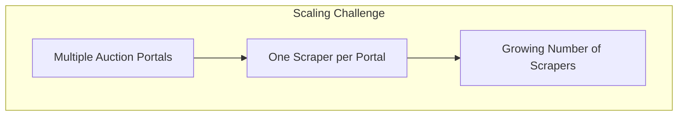

### Maintenance

Auction portals change their layouts and data structures over time. When a portal changes, its scraper breaks. Every scraper must be actively monitored and updated.

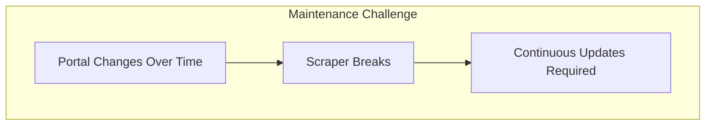

These two challenges compound: as the number of scrapers grows (scaling), so does the maintenance burden.

---

*See also: [[Systems/Web-Scraping/Integration|Integration details →]]  
[[Systems/Overview|Back to Systems Overview →]]*
````

- [ ] **Step 2: Verify**

```bash
grep -c '```mermaid' content/Systems/Web-Scraping/Overview.md
```

Expected: `2`

- [ ] **Step 3: Commit**

```bash
git add content/Systems/Web-Scraping/Overview.md
git commit -m "docs: add Web Scraping Overview note"
```

---

## Task 9: Systems/Web-Scraping/Integration.md

**Files:**
- Create: `content/Systems/Web-Scraping/Integration.md`

- [ ] **Step 1: Create the file**

````markdown
---
title: Web Scraping — Integration
tags: [systems, web-scraping]
---

# Web Scraping Integration

The WS component has the simplest integration boundary in the Surplus system. Its only outbound concern is writing extracted data to the [[Systems/API-Database/Overview|API & Database component]].

## Data Flow

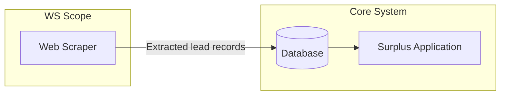

## What WS Sends to AND

Each scraped record includes:

| Field | Description |
|-------|-------------|
| Full name | Property owner's name |
| Contact details | Phone, address, email (if available) |
| Surplus amount | Dollar value of unclaimed funds |
| County | Source county |
| Auction date | When the auction occurred |
| Property details | Address, parcel ID |

## Integration Rules

- WS only **writes** to AND — it never reads from it
- WS does not communicate with GHL or RAG/KB directly
- Each scraper run should be idempotent: re-scraping the same auction should not create duplicate records (AND is responsible for deduplication or the scraper should check before insert)

---

*See also: [[Systems/Web-Scraping/Overview|Web Scraping Overview ←]]  
[[Systems/API-Database/Overview|API & Database receives this data →]]*
````

- [ ] **Step 2: Verify**

```bash
grep -c '```mermaid' content/Systems/Web-Scraping/Integration.md
```

Expected: `1`

- [ ] **Step 3: Commit**

```bash
git add content/Systems/Web-Scraping/Integration.md
git commit -m "docs: add Web Scraping Integration note"
```

---

## Task 10: Systems/API-Database/Overview.md

**Files:**
- Create: `content/Systems/API-Database/Overview.md`

- [ ] **Step 1: Create the file**

````markdown
---
title: API & Database — Overview
tags: [systems, api-database]
---

# API & Database Component

The API & Database (AND) component is the central data layer of the Surplus application. Every other component connects through it, making AND the most complex integration point in the system.

## Role

AND manages all lead and client information. This includes:

- Raw data ingested from [[Systems/Web-Scraping/Overview|Web Scraping]]
- Supporting information added during the pipeline
- Lead/client status throughout the acquisition lifecycle
- Interaction logs from [[Systems/GoHighLevel/Overview|GoHighLevel]]

**AND is the single source of truth.** Other components (GHL, RAG/KB) may hold local copies of data, but AND's records are authoritative.

## Responsibilities

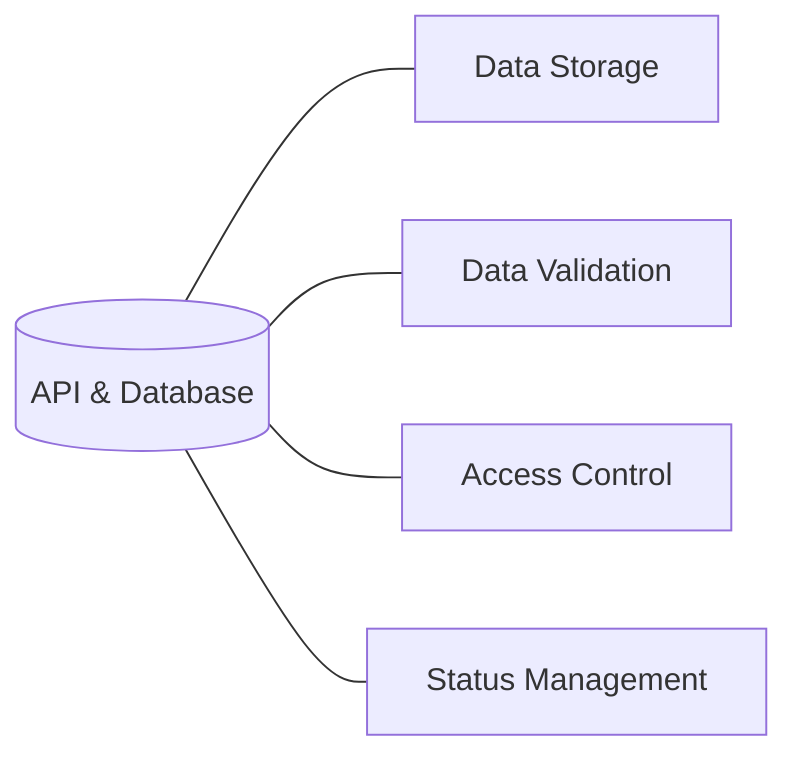

| Responsibility | Description |
|----------------|-------------|
| **Data Storage** | Persist all lead/client records, supporting documents, and logs |
| **Data Validation** | Ensure incoming data meets schema requirements before storage |
| **Access Control** | Regulate which components can read or write which records |
| **Status Management** | Track each lead's position in the acquisition lifecycle |

## Design Priority

The primary concern is ensuring data is **easily sent, retrieved, updated, and tracked**. Proper SQL table design is critical. Schema changes have downstream impact on every connected component.

---

*See also: [[Systems/API-Database/Integration|Integration details →]]  
[[Systems/Overview|Back to Systems Overview →]]*
````

- [ ] **Step 2: Verify**

```bash
grep -c '```mermaid' content/Systems/API-Database/Overview.md
```

Expected: `1`

- [ ] **Step 3: Commit**

```bash
git add content/Systems/API-Database/Overview.md
git commit -m "docs: add API & Database Overview note"
```

---

## Task 11: Systems/API-Database/Integration.md

**Files:**
- Create: `content/Systems/API-Database/Integration.md`

- [ ] **Step 1: Create the file**

````markdown
---
title: API & Database — Integration
tags: [systems, api-database]
---

# API & Database Integration

AND connects to every other component in the Surplus system. It is the glue that holds the application together.

## Full Integration Map

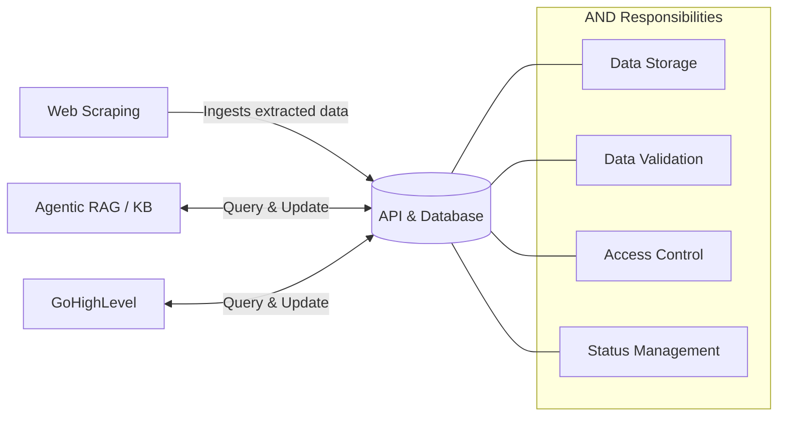

## Integration by Component

### Web Scraping → AND
- **Direction:** One-way write (WS writes, AND stores)
- **Payload:** Lead records extracted from county portals
- **Concern:** Deduplication — same auction may be scraped multiple times

### AND ↔ GoHighLevel
- **Direction:** Bidirectional
- **AND → GHL:** Provides qualified leads for campaign execution
- **GHL → AND:** Writes back interaction logs, status updates, and outcome data
- **Rule:** GHL must not be used as the authoritative record. All status changes must sync back to AND.

### AND ↔ Agentic RAG / KB
- **Direction:** Bidirectional
- **AND → RAG/KB:** Provides lead context for AI decision-making
- **RAG/KB → AND:** May write enriched data or AI-generated summaries back

## Why AND Complexity Is Highest

- Every component integrates through AND
- Schema changes break all consumers simultaneously
- Status management must handle concurrent reads and writes from GHL and RAG/KB
- Proper indexing is critical for query performance at scale

---

*See also: [[Systems/API-Database/Overview|API & Database Overview ←]]  
[[Systems/GoHighLevel/Integration|GoHighLevel Integration →]]  
[[Systems/Web-Scraping/Integration|Web Scraping Integration ←]]*
````

- [ ] **Step 2: Verify**

```bash
grep -c '```mermaid' content/Systems/API-Database/Integration.md
```

Expected: `1`

- [ ] **Step 3: Commit**

```bash
git add content/Systems/API-Database/Integration.md
git commit -m "docs: add API & Database Integration note"
```

---

## Task 12: Systems/GoHighLevel/Overview.md

**Files:**
- Create: `content/Systems/GoHighLevel/Overview.md`

- [ ] **Step 1: Create the file**

````markdown
---
title: GoHighLevel — Overview
tags: [systems, gohighlevel]
---

# GoHighLevel Component

GoHighLevel (GHL) is the **CRM and workflow engine** of the Surplus application. It orchestrates the execution layer — managing outreach campaigns, handling lead interactions, and routing data between the AI decision layer and human staff.

## Role in the Pipeline

GHL sits between the data layer ([[Systems/API-Database/Overview|AND]]) and the execution tools. It:

1. Receives qualified leads from AND
2. Requests messaging strategy from [[Systems/Agentic-RAG/Overview|Agentic RAG / KB]]
3. Executes outreach via SMS, voice calls, and email
4. Processes responses and routes warm leads to human closers
5. Writes interaction data and status updates back to AND

## Execution Channels

| Channel | Tool |
|---------|------|
| SMS | DropCowboy |
| Voice Calls | Retell AI + ElevenLabs |
| Email | GHL Native |

## Website Builder

GHL also provides built-in website creation tools. This is used to build a client-facing site that informs leads and clients about the Surplus Funds Acquisition process, establishing credibility before and during the closing phase.

## Data Ownership Rule

GHL stores data locally for operational efficiency, but **AND is the source of truth**. Every status change, interaction log, and outcome recorded in GHL must be written back to AND to keep the system in sync.

---

*See also: [[Systems/GoHighLevel/Integration|Full data flow diagram →]]  
[[Systems/Overview|Back to Systems Overview →]]*
````

- [ ] **Step 2: Verify**

```bash
cat content/Systems/GoHighLevel/Overview.md | grep "## "
```

Expected: Role in the Pipeline, Execution Channels, Website Builder, Data Ownership Rule

- [ ] **Step 3: Commit**

```bash
git add content/Systems/GoHighLevel/Overview.md
git commit -m "docs: add GoHighLevel Overview note"
```

---

## Task 13: Systems/GoHighLevel/Integration.md

**Files:**
- Create: `content/Systems/GoHighLevel/Integration.md`

- [ ] **Step 1: Create the file**

````markdown
---
title: GoHighLevel — Integration
tags: [systems, gohighlevel]
---

# GoHighLevel Integration

GHL is the most connected operational component in the Surplus system. It coordinates between the data layer, the AI decision engine, and the outreach execution tools.

## Full Data Flow

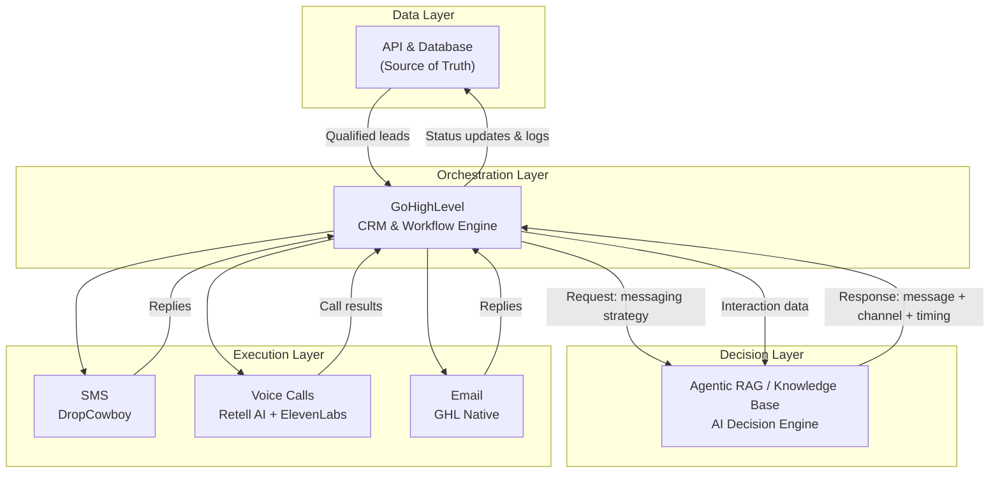

## Integration Details

### AND → GHL
- AND pushes qualified leads to GHL to begin campaign execution
- Lead records include all skip-traced data plus any enrichment added since ingestion

### GHL → RAG/KB (Request)
- Before each outreach action, GHL queries RAG/KB for the optimal message, channel, and timing
- RAG/KB uses lead context + business knowledge to formulate a strategy

### RAG/KB → GHL (Response)
- RAG/KB returns a structured response: which channel to use, what message to send, when to send it
- GHL executes that strategy via the appropriate channel tool

### Execution Layer → GHL (Inbound)
- SMS replies, call outcomes, and email responses all flow back into GHL
- GHL processes these to determine next actions (follow-up, escalate to human closer, close)

### GHL → ARKB (Feedback)
- Interaction data is fed back to RAG/KB to update its context on the lead
- Enables the AI to adjust strategy based on how the lead has responded

### GHL → AND (Write-back)
- All status changes and interaction logs are written back to AND
- This is mandatory — AND must stay authoritative

---

*See also: [[Systems/GoHighLevel/Overview|GoHighLevel Overview ←]]  
[[Systems/Agentic-RAG/Overview|Agentic RAG / KB →]]  
[[Systems/API-Database/Integration|API & Database Integration ←]]*
````

- [ ] **Step 2: Verify**

```bash
grep -c '```mermaid' content/Systems/GoHighLevel/Integration.md
```

Expected: `1`

- [ ] **Step 3: Commit**

```bash
git add content/Systems/GoHighLevel/Integration.md
git commit -m "docs: add GoHighLevel Integration note with full data flow diagram"
```

---

## Task 14: Systems/Agentic-RAG/Overview.md

**Files:**
- Create: `content/Systems/Agentic-RAG/Overview.md`

- [ ] **Step 1: Create the file**

```markdown
---
title: Agentic RAG / Knowledge Base — Overview
tags: [systems, agentic-rag]
---

# Agentic RAG / Knowledge Base

The Agentic RAG / Knowledge Base (RAG/KB) component is the **AI decision engine** of the Surplus application. It prepares and serves context-aware information to other components, primarily [[Systems/GoHighLevel/Overview|GoHighLevel]].

## Role

RAG/KB is supplied with:

- Manuals and protocols about Surplus Funds Acquisition
- Business operations documents
- Historical interaction data

When queried, it uses this knowledge to generate context-aware responses — such as the optimal message, channel, and timing for a given lead.

## Integration

RAG/KB exposes endpoints that GHL calls during campaign execution. It receives lead context from AND (via GHL) and returns actionable strategy.

It also receives interaction feedback from GHL after each outreach action, allowing it to refine its context on each lead over time.

See [[Systems/GoHighLevel/Integration|GoHighLevel Integration]] for the full data flow showing how RAG/KB fits into the pipeline.

---

*See also: [[Systems/Overview|Back to Systems Overview →]]*
```

- [ ] **Step 2: Verify**

```bash
cat content/Systems/Agentic-RAG/Overview.md | grep "## "
```

Expected: Role, Integration

- [ ] **Step 3: Commit**

```bash
git add content/Systems/Agentic-RAG/Overview.md
git commit -m "docs: add Agentic RAG / KB Overview note"
```

---

## Task 15: Engineering/Git-Guidelines.md

**Files:**
- Create: `content/Engineering/Git-Guidelines.md`

- [ ] **Step 1: Create the file**

````markdown
---
title: Git Guidelines
tags: [engineering]
---

# Git Guidelines

## Branch Format

```
<branch-type>/<branch-name>-#<ticket-tag>
```

All characters lowercase. Use kebab-case for spaces.

**Example:** `feature/task-one-#F001`

## Branch Types

| Type | Purpose |
|------|---------|
| `feature` | Feature implementations |
| `bug` | Bug fixes |
| `refactor` | Re-implementing existing features |
| `doc` | Documentation |

## PR Guidelines

1. Create branch from the correct base branch
2. **Link the branch to the related GitHub issue**
3. Implement changes and push commits
4. Create PR targeting the **Develop branch**
5. **Link PR to issue**
6. **Move issue to "For Review"**
7. Address review feedback if needed
   - Maximum of **2 PR cycles** allowed
   - After the 2nd cycle, it merges into develop and the DATL aligns the feature to spec if needed
8. Merge upon approval and update issue status

## Ticket Lifecycle

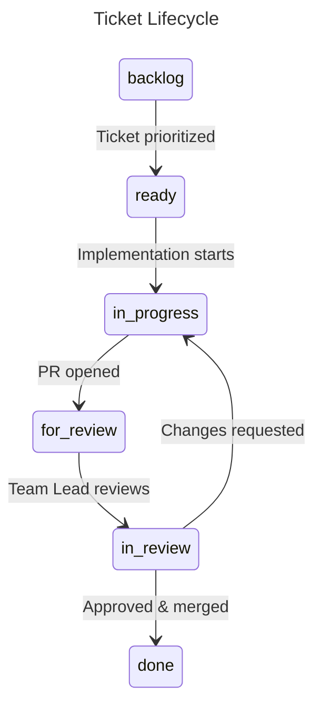

---

*See also: [[Engineering/Branching-Strategy|Branching Strategy →]]*
````

- [ ] **Step 2: Verify**

```bash
grep -c '```mermaid' content/Engineering/Git-Guidelines.md
```

Expected: `1`

- [ ] **Step 3: Commit**

```bash
git add content/Engineering/Git-Guidelines.md
git commit -m "docs: add Git Guidelines note"
```

---

## Task 16: Engineering/Branching-Strategy.md

**Files:**
- Create: `content/Engineering/Branching-Strategy.md`

- [ ] **Step 1: Create the file**

````markdown
---
title: Branching Strategy
tags: [engineering]
---

# Branching Strategy

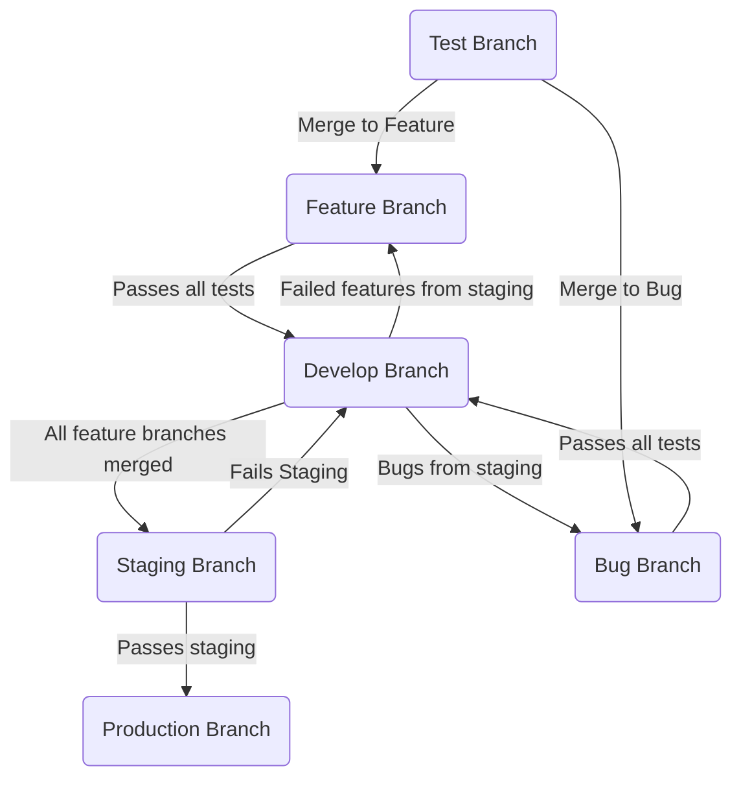

## Branch Descriptions

| Branch | Role |
|--------|------|
| **Test** | Isolated testing before merging to feature or bug branches |
| **Feature** | Active feature development |
| **Develop** | Integration branch — all passing features merge here |
| **Staging** | Pre-production validation |
| **Production** | Live, user-facing code |
| **Bug** | Hotfixes — merges back to develop after passing tests |

## Key Rules

- Test branches merge into Feature or Bug branches (never directly to Develop)
- Feature branches require passing tests before merging to Develop
- Staging failures route back to Develop, not directly to Feature
- Production is only updated from Staging after it passes

---

*See also: [[Engineering/Git-Guidelines|Git Guidelines ←]]*
````

- [ ] **Step 2: Verify**

```bash
grep -c '```mermaid' content/Engineering/Branching-Strategy.md
```

Expected: `1`

- [ ] **Step 3: Commit**

```bash
git add content/Engineering/Branching-Strategy.md
git commit -m "docs: add Branching Strategy note"
```

---

## Task 17: Engineering/Agentic-Coding.md

**Files:**
- Create: `content/Engineering/Agentic-Coding.md`

- [ ] **Step 1: Create the file**

````markdown
---
title: Agentic Coding Guidelines
tags: [engineering]
---

# Agentic Coding Guidelines

The era of writing every line of code manually is ending. Effective developers now operate as **orchestrators** — guiding autonomous AI agents to build, test, and debug software. This guide covers the workflows, configuration setups, and tool knowledge needed to integrate AI coding assistants into your daily development cycle without sacrificing code quality.

Treat your AI as an exceptionally fast, highly capable **junior engineer** who requires clear boundaries, strict instructions, and careful supervision — not as a senior mentor.

---

## 1. Manage Your Context

An AI's **context window** is its short-term memory. It holds your prompt, the files it has read, and the output it generates. It is finite.

| Context Type | Description | Risk |
|-------------|-------------|------|
| **Static Context** | Foundational project rules (e.g., CLAUDE.md). Cached — fast and cheap. | Low |
| **Dynamic Context** | Builds up as the agent reads files, runs commands, outputs logs. | High — can cause "context rot" |

**The Trap:** Tool outputs (massive error stack traces, full file dumps) are the biggest cause of context rot. If dynamic context gets too bloated, the AI forgets your original instructions and starts making mistakes.

**The Solution:** Use progressive disclosure. Give the agent lightweight file paths and let it load data only when needed. If the agent gets confused, start a fresh session to wipe the dynamic context.

---

## 2. Proven Workflows

### Workflow 1: Spec-Driven Development (SDD)

Before allowing the AI to generate a single line of code, write a `spec.md` document. This forces you to think through the architecture and gives the AI a definitive source of truth.

A good spec includes:

| Section | Content |
|---------|---------|
| **Objective** | What are we building? |
| **Tech Stack** | Languages, frameworks, and exact versions |
| **Commands** | How to build, test, and lint the project |
| **Boundaries** | Explicit rules — "Always run tests before commits", "Never commit secrets", "Ask before modifying database schemas" |

Notable SDD toolkits: OpenSpec, SpecKit.

### Workflow 2: The Plan-Act-Reflect Loop

Enforce a strict operational loop to prevent the agent from rushing into code with unchecked assumptions:

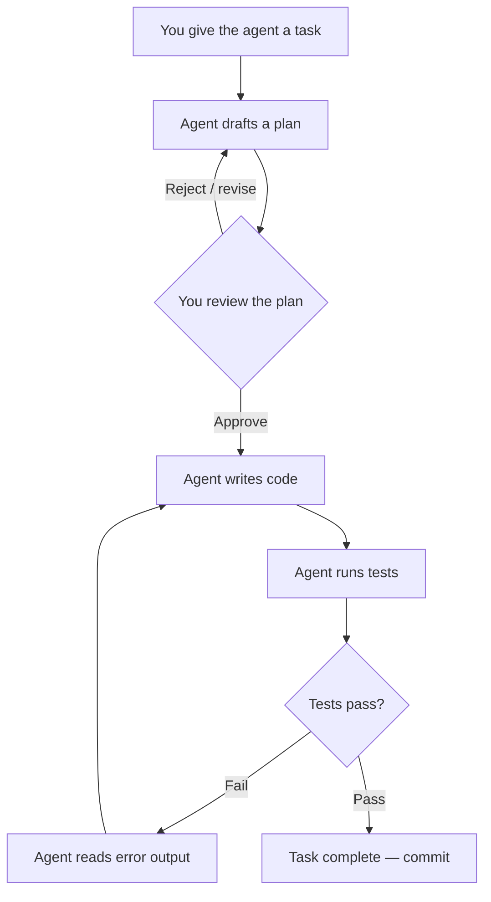

**The Planning Gate:** Always stop after drafting a plan and get your approval. Catching architectural mistakes at plan stage prevents thousands of lines of messy code.

**The Execution Sub-loop:** Once approved, the agent writes code, runs tests (defined in your spec), reads terminal output, and self-corrects without you needing to paste errors.

### Workflow 3: Agentic Debugging

Do not blindly paste an error stack trace into the AI and ask for a fix.

1. **Reason first, then act:** Force the AI to explain its understanding of the data flow and root cause *before* generating a code patch
2. **Add logging:** Ask the AI to inject debug statements first, run the app, and feed actual runtime logs back to the agent
3. **Keep state clean:** If the agent fails after a few tries, context is likely polluted — start a fresh session

### Workflow 4: Version Control and Code Review

> **Golden rule:** AI agents can propose code, but they never own it.

- **Draft PRs only:** Configure your agent to open only draft Pull Requests. Never allow an AI to push directly to main or production
- **Mandatory human review:** Treat the agent's PR exactly as you would a human's — review logic, check edge cases, verify security (input validation, auth logic)

---

## 3. Harness Engineering — CLAUDE.md / AGENTS.md

Create a `CLAUDE.md` or `AGENTS.md` file in the root of your repository. This acts as the agent's **permanent memory and system prompt** for the project.

**Rules for writing it:**

- Keep it under 200 lines — saves token costs and ensures the AI reads it carefully
- Make it **corrective, not just descriptive** — enforce rules based on past mistakes
  - Example: *"Always use forward slashes for file paths on Windows"*
  - Example: *"Never auto-commit code; ask for explicit permission first"*

---

## 4. MCPs — The Model Context Protocol

MCP acts as a universal adapter, giving your AI agent "hands" to interact with external systems — reading files, querying databases, searching the web, or managing your GitHub repository.

**How it works:**

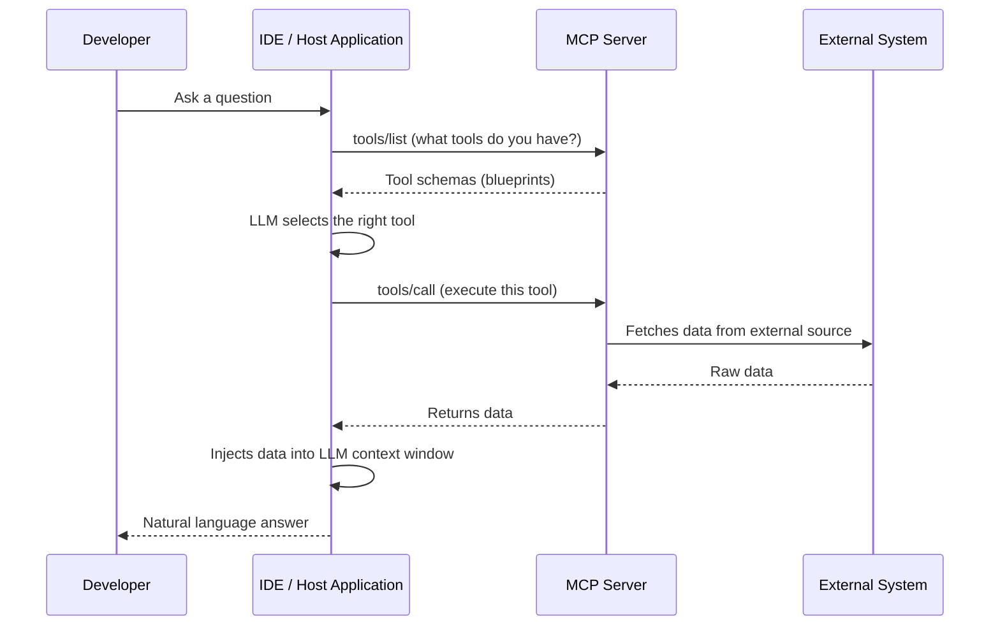

**Essential MCP Servers:**

| MCP | Use |
|-----|-----|
| **GitHub MCP** | Read issues, review PRs, manage repository autonomously |
| **Playwright / Browserbase** | Control headless browser, run visual and E2E tests |
| **Context7** | Live developer documentation — prevents hallucinated outdated syntax |
| **Code-Review-Graph** | Parses codebase into AST via Tree-sitter, stored in SQLite. Agents query structure instead of grepping files — up to 120x token reduction on large tasks |
| **Graphify** | Similar to Code-Review-Graph — exposes codebase graph as LLM-callable tools for deep structural understanding |

---

## 5. AI Coding Tool Comparison

| Dimension | GitHub Copilot | Claude Code | Google Antigravity |
|-----------|---------------|------------|-------------------|
| **Interface** | Editor extension (VS Code, etc.) | CLI (terminal) | Standalone IDE |
| **Autonomy** | Medium — suggestions only, manual orchestration | High — autonomous terminal access, agentic loops | High — enforced Plan/Execute loops, built-in browser |
| **Best For** | Inline syntax help within familiar IDE | Deep reasoning for multi-step engineering backlogs | Architectural planning with persistent markdown artifacts |

*Open-source alternatives: **Aider** (terminal-first, git-native), **Pi** (minimalist), **Cline** (VS Code agentic assistant)*

---

## Conclusion

Agentic coding is not about letting an AI do your job. It is about elevating your role from **syntax-writer** to **system architect**. By mastering Spec-Driven Development, enforcing Plan-Act-Reflect loops, properly configuring CLAUDE.md, and leveraging MCP tools, developers can safely harness the productivity gains of modern AI assistants.
````

- [ ] **Step 2: Verify**

```bash
grep -c '```mermaid' content/Engineering/Agentic-Coding.md
```

Expected: `2`

- [ ] **Step 3: Commit**

```bash
git add content/Engineering/Agentic-Coding.md
git commit -m "docs: add Agentic Coding Guidelines note"
```

---

## Task 18: Operations/Scrum-Handbook.md

**Files:**
- Create: `content/Operations/Scrum-Handbook.md`

- [ ] **Step 1: Create the file**

````markdown
---
title: Scrum Handbook — Surplus Project
tags: [operations]
---

# Metawatt Scrum Handbook — Surplus Project

Effective project management is the key to maximizing productivity across 20+ developers on 3 distinct teams.

**Core Philosophy:** Every developer undergoes 3-day Scrum training. One developer per team assumes the Scrum Master role at the end of that period. **Any developer can (and should) act as Scrum Master if the designated person is absent.**

---

## 1. Scrum Terms

| Term | Definition |
|------|-----------|
| **Sprint** | Fixed time-boxed period (1–2 weeks) to produce a usable product increment |
| **Backlog** | Master list of all tasks, features, and requirements |
| **Sprint Backlog** | Subset of Backlog items selected for the current Sprint |
| **Scrum Master (SM)** | Servant-leader who facilitates Scrum events, removes blockers, ensures agile practices |
| **Blocker / Impediment** | Any issue (technical or organizational) preventing a developer from completing their task |
| **Ticket / Issue** | A single unit of work on the project board |
| **Kanban / Scrum Board** | Visual representation of work phases: To Do, In Progress, In Review, Done |
| **Increment** | Sum of all completed and merged work at Sprint end |
| **Velocity** | Measure of how much work a team completes per Sprint |
| **Scrum of Scrums** | Weekly sync where team Scrum Masters meet with Team Leads to coordinate cross-team dependencies |

---

## 2. Team Structure

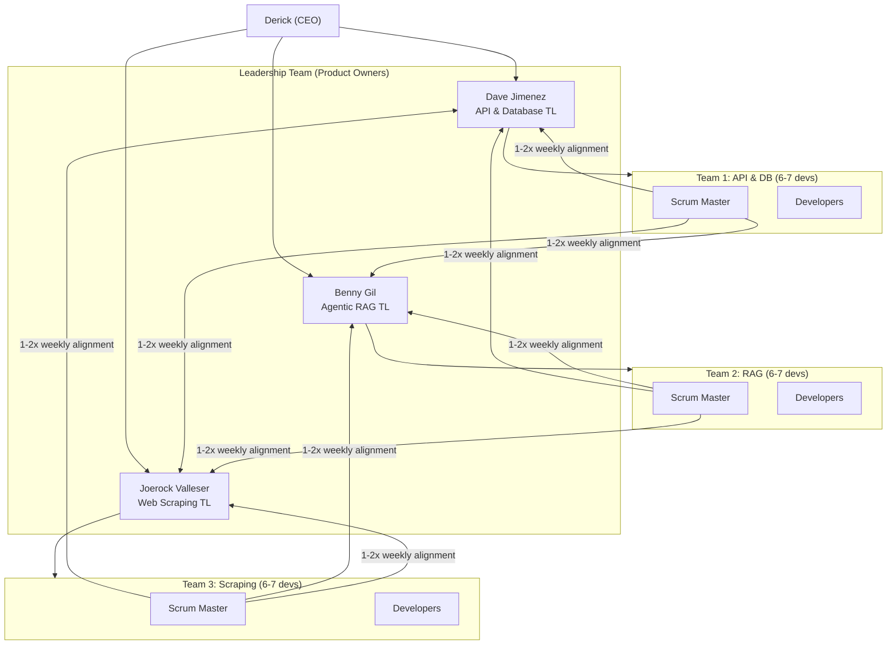

### Roles

| Role | Responsibility |
|------|---------------|
| **Developers** | Self-managing. Estimate own work, pick up tickets, collaborate |
| **Scrum Master** | Tracks, facilitates, removes blockers. Any developer can step in if SM is absent |
| **Team Leads (Dave, Benny, Joerock)** | Product Owners. Prioritize backlog, accept completed work, define technical vision |

---

## 3. Sprint Lifecycle

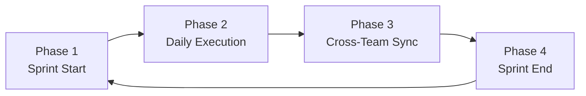

### Phase 1: Sprint Start

1. **Prioritization:** Team Leads prioritize the Master Backlog
2. **Sprint Planning:** Team and Team Leads agree on the Sprint Goal. Developers pull tickets into the Sprint Backlog, estimate effort, and flag cross-team dependencies

### Phase 2: Daily Execution

1. **Daily Scrum (15 min max):** Each developer answers:
   - *What did I accomplish yesterday?*
   - *What will I work on today?*
   - *Are there any blockers in my way?*
   > Do not solve deep technical problems during standup. Take them to a separate discussion immediately after.

2. **Board Updates & Unblocking:** Scrum Master updates the board and acts immediately on any raised blockers

### Phase 3: Cross-Team Sync

1. **Leadership Alignment Meeting (1–2x weekly):** Scrum Masters meet with Dave, Benny, and Joerock to report velocity, highlight cross-team dependencies, and align for upcoming sprints

### Phase 4: Sprint End

1. **Sprint Review:** Team demos working software / completed tickets to Team Leads
2. **Sprint Retrospective:** Internal meeting — what went well, what went wrong, process improvements for the next Sprint

---

## 4. Board Management

Rules apply regardless of whether the team uses GitHub Projects, ClickUp, or any other PM tool.

### Ticket States

| State | Meaning |
|-------|---------|
| **To Do** | Planned for the sprint but not started |
| **In Progress** | Currently being worked on *(limit WIP to avoid context switching)* |
| **In Review** | Code complete, awaiting PR review or QA *(max 2 PR cycles before merge to develop)* |
| **Done** | Merged, tested, and accepted |

### Ticket Hygiene

A ticket is not valid unless it has:
- Clear title and description
- An assignee (who is doing the work)
- Acceptance criteria (how do we know it is "Done"?)
- Direct link to associated GitHub branch and Pull Request

### Flagging Blockers

Blocked tickets must be visibly flagged (label, tag, or "Blocked" column) so the Scrum Master can spot and act on them immediately.

---

## 5. Scrum Master Checklists

### Daily Checklist

- [ ] **Review the Board** — Before Daily Scrum, check for tickets in "In Progress" too long or missing assignees
- [ ] **Facilitate Daily Scrum** — Start on time, stay under 15 minutes, prevent deep technical debates
- [ ] **Unblock the Team** — Identify blockers from standup and coordinate with other teams or Team Leads to resolve
- [ ] **Stakeholder Transparency** — Ensure board state accurately reflects reality for async viewing by Dave, Benny, Joerock

### Weekly / Sprint Checklist

- [ ] **Prep the Backlog** — Ensure backlog is prioritized and tickets are well-defined before Sprint Planning
- [ ] **Facilitate the Retrospective** — Create a safe space for developers to voice frustrations and celebrate wins
- [ ] **Attend Leadership Alignment** — Bring data: team velocity, biggest risks, cross-team support needed

---

*See also: [[Essentials/Personnel|Personnel — team contacts →]]  
[[Operations/Daily-Schedule|Daily Schedule →]]*
````

- [ ] **Step 2: Verify**

```bash
grep -c '```mermaid' content/Operations/Scrum-Handbook.md
```

Expected: `2`

- [ ] **Step 3: Commit**

```bash
git add content/Operations/Scrum-Handbook.md
git commit -m "docs: add Scrum Handbook note"
```

---

## Task 19: Operations/Daily-Schedule.md and Calendar.md

**Files:**
- Create: `content/Operations/Daily-Schedule.md`
- Create: `content/Operations/Calendar.md`

- [ ] **Step 1: Create Daily-Schedule.md**

```markdown
---
title: Daily Schedule
tags: [operations]
---

# Daily Schedule

| Time | Event | Description |
|------|-------|-------------|
| **5:00** | Start of Internship | Interns log in to the internship |
| **6:05** | Roll Call | Confirmation of attendance by the Roll Call Master |
| **6:20** | Internship Proper | Perform internship duties assigned by Team Leads |
| **12:50** | End of Day (EOD) | Submission of EOD report |

---

*See also: [[Operations/Scrum-Handbook|Scrum Handbook — Daily Scrum guidelines →]]*
```

- [ ] **Step 2: Create Calendar.md**

```markdown
---
title: Calendar
tags: [operations]
---

# Calendar

## May 2026

| S | M | T | W | Th | F | Sa |
|---|---|---|---|----|----|-----|
| | | | | | **1** Team Lead Meeting | 2 |
| 3 | **4** Surplus Funds Project Resume | **5** AI Coding Tools Workshop | **6** Scrum Master Designation | 7 | 8 | 9 |
| 10 | 11 | 12 | 13 | 14 | ~~15 Phase 1 Deadline~~ | 16 |
| 17 | 18 | 19 | 20 | 21 | **22** Integration: Web Scraper → DB | 23 |
| 24 | 25 | 26 | 27 | 28 | **29** Phase 1 Deadline | 30 |
| 31 | | | | | | |

## June 2026

| S | M | T | W | Th | F | Sa |
|---|---|---|---|----|----|-----|
| | **1** Start of Summer Internship | 2 | 3 | 4 | 5 | 6 |
| 7 | 8 | 9 | 10 | 11 | **12** Phase 2 Deadline | 13 |
| 14 | 15 | 16 | 17 | 18 | 19 | 20 |
| 21 | 22 | 23 | 24 | 25 | **26** Phase 3 Deadline | 27 |
| 28 | 29 | 30 | | | | |

## July 2026

| S | M | T | W | Th | F | Sa |
|---|---|---|---|----|----|-----|
| | | | 1 | 2 | **3** Tentative Launch Date | 4 |
| 5 | 6 | 7 | 8 | 9 | 10 | 11 |
```

- [ ] **Step 3: Verify**

```bash
ls content/Operations/
```

Expected: `Calendar.md  Daily-Schedule.md  Scrum-Handbook.md`

- [ ] **Step 4: Commit**

```bash
git add content/Operations/
git commit -m "docs: add Daily Schedule and Calendar notes"
```

---

## Task 20: Delete Source File and Final Verification

**Files:**
- Delete: `content/MetaWatt Internship Guidebook.md`

- [ ] **Step 1: Verify all 20 expected files exist**

```bash
find content/ -name "*.md" | grep -v ".obsidian" | sort
```

Expected output:
```
content/Essentials/Communications.md
content/Essentials/Personnel.md
content/Engineering/Agentic-Coding.md
content/Engineering/Branching-Strategy.md
content/Engineering/Git-Guidelines.md
content/Introduction.md
content/Operations/Calendar.md
content/Operations/Daily-Schedule.md
content/Operations/Scrum-Handbook.md
content/Surplus-Funds/Overview.md
content/Surplus-Funds/SFA-Process.md
content/Systems/Agentic-RAG/Overview.md
content/Systems/API-Database/Integration.md
content/Systems/API-Database/Overview.md
content/Systems/GoHighLevel/Integration.md
content/Systems/GoHighLevel/Overview.md
content/Systems/Overview.md
content/Systems/Web-Scraping/Integration.md
content/Systems/Web-Scraping/Overview.md
content/index.md
content/MetaWatt Internship Guidebook.md
```

If any file is missing, create it before proceeding.

- [ ] **Step 2: Verify Mermaid block count across Systems/**

```bash
grep -r '```mermaid' content/Systems/ | wc -l
```

Expected: at least `7` (one or more per component note)

- [ ] **Step 3: Delete the source file**

```bash
git rm "content/MetaWatt Internship Guidebook.md"
```

- [ ] **Step 4: Final commit**

```bash
git add content/
git commit -m "docs: decompose MetaWatt Internship Guidebook into organized vault

- 20 notes across Systems/, Essentials/, Surplus-Funds/, Engineering/, Operations/
- Systems section has full component + integration notes with Mermaid diagrams
- All diagrams rewritten as native Mermaid code blocks
- WikiLinks connect all related notes
- Source monolith removed"
```
